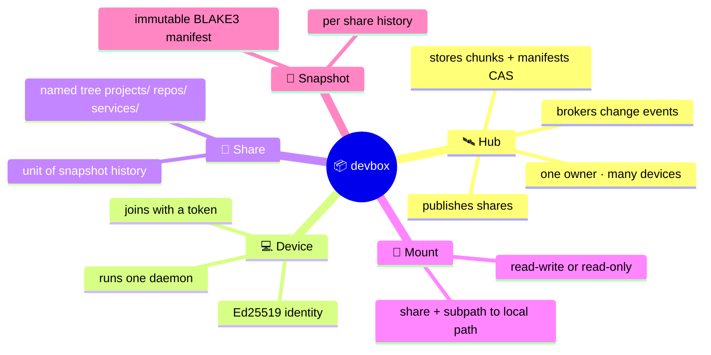
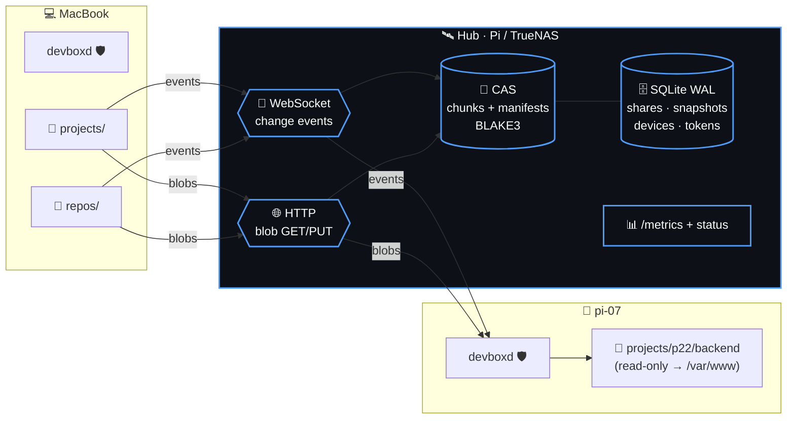
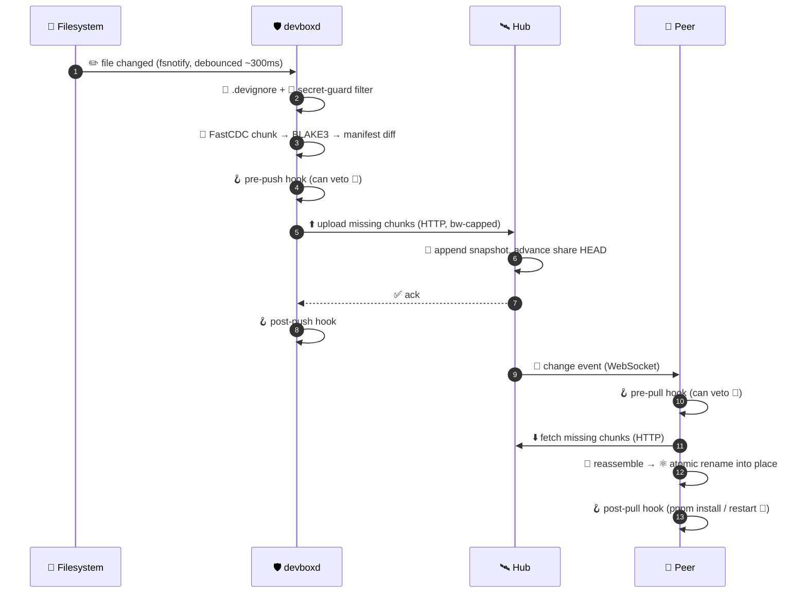
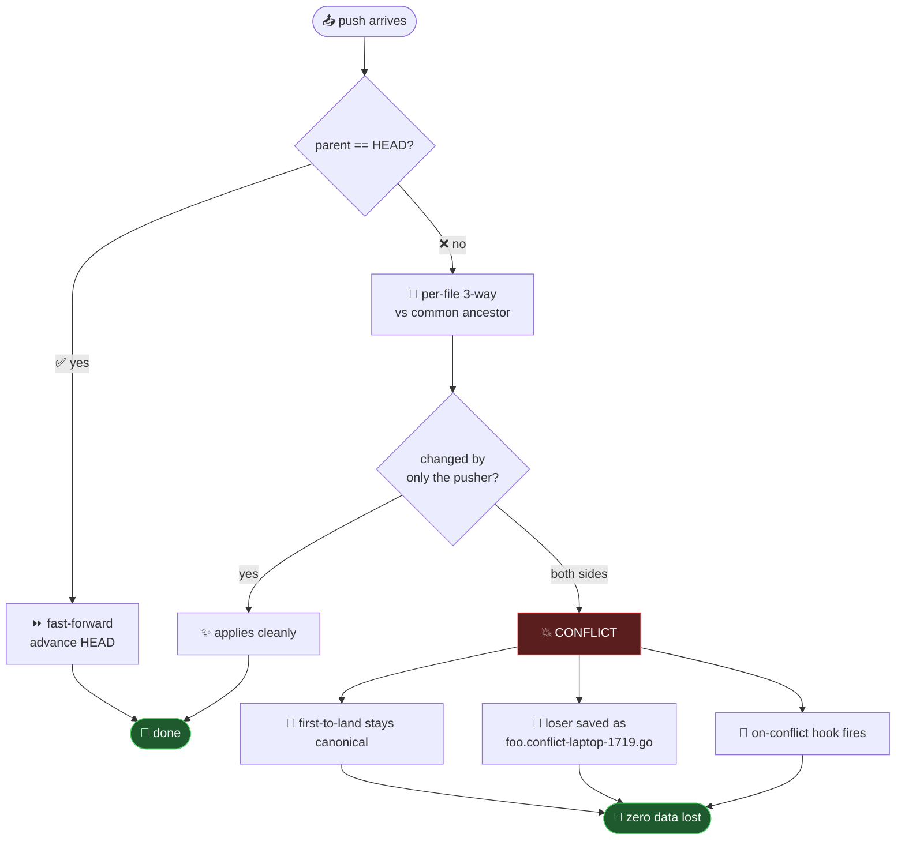
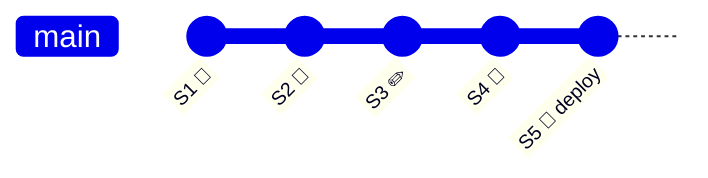

<!-- ════════════════════════════════════════════════════════════════════ -->
<div align="center">


### 📦 **Continuous file sync for developers — like Dropbox, but it respects your `.devignore`, refuses to leak secrets, runs your hooks, and keeps Git-like history.** 📦

<br/>


</div>

<!-- ════════════════════════════════════════════════════════════════════ -->

```
        ╔═══════════════════════════════════════════════════════════╗
        ║   ┌─┐ ┌─┐ ┬  ┬ ┌┐ ┌─┐ ┬ ┬                                 ║
        ║   ││─┤ ├┤  │  │ ├┴┐│ │ │┴┤   sync your dev tree,           ║
        ║   ┴─┘─┘└─┘  └──┘ └─┘└─┘ ┴ ┴   skip the junk, keep history  ║
        ╚═══════════════════════════════════════════════════════════╝
```

> [!NOTE]
> 🔨 **devbox is under active construction.** The [spec](docs/superpowers/specs/2026-06-22-devbox-design.md)
> is complete and the foundation is being built milestone by milestone. **Some commands below
> describe the v1 design and aren't wired up yet** — see the honest build status. Star/watch and
> follow along. ⭐
>
> | Milestone | Status |
> |---|---|
> | M0 — Skeleton (CLI, identity, config) | ✅ done |
> | M1 — Watch · `.devignore` · secret-guard · chunking · manifest | ✅ done |
> | M2 — Hub + one-way push (deployed + verified cross-machine 🛰️) | ✅ done |
> | M3 — Two-way sync · SSE fan-out · 3-way conflict copies · live daemon | ✅ done — **two real Macs sync live through the hub** 🔄 |
> | M4 — Read-only mounts · **sub-path mounts** · bandwidth cap | ✅ done — fleet-verified |
> | M5 — Lifecycle hooks (pre/post push/pull, on-conflict) | 🔨 building |
> | M6+ | ⬜ design complete, not started |

---

## 📑 Table of Contents

| | | |
|---|---|---|
| 🤔 [Why devbox?](#-why-devbox) | 🧠 [Core Concepts](#-core-concepts) | 🏗️ [Architecture](#%EF%B8%8F-architecture) |
| 🔄 [How Sync Works](#-how-sync-works) | 💥 [Conflicts](#-conflicts-never-lose-a-byte) | 🚀 [Quick Start](#-quick-start) |
| 🧰 [CLI Reference](#-cli-reference) | 🪝 [Hooks](#-hooks) | 🙈 [.devignore & Secrets](#-devignore--secret-guard) |
| 🕰️ [Versioning & Deploy](#%EF%B8%8F-versioning--deploy) | 🖥️ [Cross-Platform](#%EF%B8%8F-cross-platform) | 🗺️ [Roadmap](#%EF%B8%8F-roadmap) |
| ⚖️ [License & Open-Core](#%EF%B8%8F-license--open-core) | 🙌 [Contributing](#-contributing) | |

---

## 🤔 Why devbox?

You've got a MacBook, a 40-node Pi cluster, and a TrueNAS box. You want your **active working
tree** mirrored across them — *right now*, automatically — without committing half-done work.

Your options today all hurt:

<table>
<tr>
<th>Tool</th><th>The pain 😖</th>
</tr>
<tr>
<td>☁️ <b>Dropbox / iCloud</b></td>
<td>Syncs <i>everything</i> blindly — chokes on <code>node_modules</code>, happily uploads your <code>.env</code>, thrashes on build artifacts.</td>
</tr>
<tr>
<td>🐙 <b>Git</b></td>
<td>Manual. Commit-based. Not built to live-mirror an in-progress working tree. Branching ≠ syncing.</td>
</tr>
<tr>
<td>📁 <b>rsync / scp</b></td>
<td>One-shot, one-direction, no history, no hooks, no conflict safety. You babysit it.</td>
</tr>
<tr>
<td>🔁 <b>Syncthing</b></td>
<td>Great P2P sync — but no <code>.devignore</code> dev-ergonomics, no lifecycle hooks, no snapshot/deploy story.</td>
</tr>
</table>

### ✨ devbox is the missing layer

<div align="center">

| 🎯 | Feature |
|:---:|:---|
| 🔄 | **Continuous bidirectional sync** across all your machines |
| 🙈 | **`.devignore`** (gitignore syntax) — skip `node_modules`, `dist`, the junk |
| 🔐 | **Default-on secret guard** — *hard-refuses* to upload `.env`, keys, secrets |
| 🪝 | **Lifecycle hooks** — `pnpm install` / restart a container when files land |
| 🕰️ | **Git-like snapshots** per share — roll back any file, any time |
| 🎚️ | **Selective mounts** — cherry-pick a share, or *just one sub-path*, per machine |
| 💥 | **Conflict-safe** — never blocks, never asks, **never loses a byte** |
| 🏠 | **Self-hostable** — one Go binary on your Pi/TrueNAS, no SaaS required |
| 🌍 | **Cross-platform** — Linux · macOS · Windows |

</div>

---

## 🧠 Core Concepts



| Term | What it is |
|---|---|
| 🛰️ **Hub** | The server. Publishes shares, stores content-addressed chunks + manifests, brokers events. One owner, many devices. Self-hosted single binary. |
| 💻 **Device** | A machine with an Ed25519 identity, joined to a hub. Runs one daemon (`devboxd`). |
| 📂 **Share** | A named top-level tree on the hub (`projects`, `repos`, `services`). The unit of permission & history. |
| 🔗 **Mount** | A device-side binding: `share[/subpath] → localpath`, read-write or read-only. One daemon watches many. |
| 📸 **Snapshot** | An immutable, per-share manifest version (id = BLAKE3 of the manifest). |

---

## 🏗️ Architecture



> 💡 **Why two channels?** WebSocket for live events (tiny, ordered) + **stateless HTTP for
> blobs** (`GET /blob/<hash>` → range/resume/caching for free). Same TLS endpoint, same token.
> Pure-WebSocket would force us to reinvent resumable transfer over a socket — *more* code.

---

## 🔄 How Sync Works



A **read-only** mount skips steps 1–8 (it never pushes) but still receives and applies inbound
changes. 🔒

---

## 💥 Conflicts: Never Lose a Byte

devbox is **Dropbox-easy** (never nags you mid-work) **and** data-loss-proof. Here's the magic:
the hub keeps a **linear HEAD per share**, and every push declares the snapshot it was based on.



<details>
<summary>📖 <b>The classic "laptop was offline" scenario — click to expand</b></summary>

<br/>

Both machines synced at snapshot `S3`, both have `foo.go` v1:

1. 🔌 **Laptop goes offline**, edits `foo.go` → **v2-laptop** (queued, parent still `S3`).
2. 🍓 **Pi (online)** edits the same `foo.go` → **v2-pi**, pushes. Hub HEAD `S3 → S4`. Pi's wins canonical.
3. 🔌 **Laptop reconnects**, pushes with `parent=S3` — but HEAD is `S4`. `parent ≠ HEAD` → conflict path.
4. 🔱 Both changed `foo.go` since `S3` → real conflict.
5. 🛟 **Result, nothing destroyed:** both machines end up with
   `foo.go` = **v2-pi** (canonical) **and** `foo.conflict-laptop-1719.go` = **v2-laptop** beside it.

The offline edit is **never lost** — it just lands as a clearly-named sibling. 🎯

</details>

**Conflict rules at a glance:**

| Situation | Outcome |
|---|---|
| 🤝 Both edit same file | First-to-land canonical; loser → `.conflict-<host>-<ts>` copy |
| 🗑️ One deletes, one edits | **Edit always wins** — a delete has no bytes to lose |
| 🔤 Rename | Free — old-gone + new-added; content-addressed = zero re-transfer |
| 🔒 Read-only mount about to clobber a local edit | Local stashed as `.conflict-local-<ts>` first |
| 👀 You find out via | `devbox status` badge · `on-conflict` hook · `devbox conflicts` list |

> 🚫 **No blocking prompts.** A headless daemon can't prompt you, and nagging would break the
> whole "Dropbox-easy" promise. You get told; you choose when to look.

---

## 🚀 Quick Start

> 🚧 *Design preview — these commands describe v1, not a shipping binary yet.*

```bash
# 🛰️  On your hub (Pi / TrueNAS / NAS)
devbox-hub serve --data /srv/devbox --listen 0.0.0.0:8088
devbox-hub token                                # prints a one-time join token

# 💻  On your laptop
devbox join http://hub.lan:8088 <token>         # enroll this machine
devbox publish ~/Projects projects              # create a share from a folder
devbox start                                    # live-sync daemon (foreground)

# 🍓  On another machine — clone the share and keep it in sync
devbox join http://hub.lan:8088 <token>
devbox mount projects ~/Projects                # clone + register the mount
devbox start

# 🚀  A read-only deploy box — pulls, never pushes its runtime cruft back up
devbox mount api /var/www/api --ro
devbox start
```

That's it. ✨ Edit on your laptop → it lands on the Pi in near-real-time, `node_modules` stays
home, your `.env` *never leaves the building*, and `post-pull` can `pnpm install` + restart your
container automatically. 🪄

---

## 🧰 CLI Reference

<details open>
<summary>💻 <b>Device commands</b></summary>

| Command | What it does |
|---|---|
| `devbox join <hub> <token>` | 🎟️ Enroll this device against a hub |
| `devbox mount <share> <dir>` | 🔗 Mount a share into a local dir (clone + sync) |
| `devbox mount <share> <dir> --ro` | 🔒 Mount **read-only** (pull only, never push) |
| `devbox publish <dir> <name>` | 📂 Create a share from a local folder + push it |
| `devbox unmount <share>` | ⏏️ Stop syncing a mount (files stay on disk) |
| `devbox start` / `stop` | ▶️⏹️ Run / stop the daemon |
| `devbox status` | 📊 Shares, mounts, peers, conflicts, blocked secrets |
| `devbox pause` / `resume` | ⏸️▶️ Halt sync without unmounting |
| `devbox log` | 🕰️ Snapshot history |
| `devbox restore <snap> [path]` | ↩️ Roll back a file or a whole share |
| `devbox deploy <share> <snap>` | 🚢 Pin a read-only mount to a snapshot *(v1.5)* |
| `devbox conflicts` | 💥 List conflict copies |
| `devbox ignore <pattern>` | 🙈 Append to `.devignore` + rescan |
| `devbox hook edit <event>` | 🪝 Open a hook in `$EDITOR` |
| `devbox peers` | 🌐 Linked machines, online/offline, last seen |
| `devbox doctor` | 🩺 Diagnose watcher limits, perms, hook interpreter, connectivity |

</details>

<details>
<summary>🛰️ <b>Hub commands</b> (run on the hub host)</summary>

| Command | What it does |
|---|---|
| `devbox-hub serve --config <file>` | 🚀 Start the hub |
| `devbox-hub token` | 🎟️ Mint / rotate the join token |
| `devbox-hub device list` / `revoke <id>` | 📋❌ List / revoke devices |
| `devbox-hub readonly <device> <share>` | 🔒 Mark a device read-only on a share |
| `devbox-hub gc` | 🧹 Garbage-collect unreferenced chunks |

</details>

---

## 🪝 Hooks

Drop executable scripts in `<mount>/.devbox/hooks/`, named after the event. **bash everywhere**
(a `.ps1` hook auto-runs via `pwsh` on Windows 🪟). `pre-*` non-zero exit **aborts** the step.
60s timeout — a hung hook is killed, never wedges the loop. ⏱️

| Hook | Fires | Abort? | Typical use |
|---|---|:---:|---|
| `pre-push` | before upload | ✅ | 🧹 lint/format, secret scan |
| `post-push` | after upload | ❌ | 📣 notify, log, tag a snapshot |
| `pre-pull` | before apply | ✅ | 🛑 stop a container / dev server |
| `post-pull` | after apply | ❌ | 📦 `pnpm install`, migrate, restart |
| `on-conflict` | conflict copy made | ❌ | 🔔 open a diff, ping you, log |

```bash
#!/usr/bin/env bash
# .devbox/hooks/post-pull  —  reinstall deps + restart only when needed
if grep -qE 'package\.json|pnpm-lock\.yaml' "$DEVBOX_CHANGED_FILES"; then
  pnpm install --frozen-lockfile
fi
docker compose restart app   # 🚀
```

<details>
<summary>🌱 <b>Injected environment variables</b></summary>

```bash
DEVBOX_EVENT=post-pull
DEVBOX_MOUNT=/srv/project
DEVBOX_SHARE=projects
DEVBOX_HOST=pi-node-07
DEVBOX_CHANGED_FILES=/tmp/devbox-changes.txt   # newline-delimited
DEVBOX_SNAPSHOT=ab12cd34
DEVBOX_REMOTE=hub.shoemoney.ai
```

</details>

---

## 🙈 .devignore & Secret Guard

### 🙈 `.devignore` — gitignore syntax, shared at the share root

```gitignore
node_modules/      # 📦 the usual suspects
dist/  build/  .next/  target/
*.log  *.tmp  .DS_Store
!.env.example      # ❗ negate to force-include
```

Matched paths are **invisible to sync in both directions**. Change it → rescan; newly-ignored
files are **left on disk** (never deleted), they just stop syncing.

### 🔐 Secret Guard — *always on, independent of `.devignore`*

> [!IMPORTANT]
> Your pitch is "won't leak your `.env`" — so devbox **enforces it**. A built-in deny-list runs
> in the push path and **hard-refuses to upload** matched files *even if `.devignore` is
> misconfigured.* Belt **and** suspenders. 🩲

Default-blocked: `.env` · `.env.*` (except `.env.example`) · `*.pem` · `*.key` · `id_rsa*` ·
`*.p12` · `*.pfx` · `secrets/` · `*.kdbx` · common cloud-cred files. Blocked files show up in
`devbox status`. Add your own via `[secrets].extra_patterns` in `config.toml`.

---

## 🕰️ Versioning & Deploy



- 📸 Every accepted change = an **immutable snapshot** (BLAKE3 of the manifest). Manifests are
  themselves content-addressed → 100 pushes don't store the tree map 100×.
- ↩️ `devbox restore <snap> [path]` rolls back a file or whole share (itself a new change →
  reversible).
- 🚢 `devbox deploy <share> <snap>` *(v1.5)* atomically pins a read-only mount to a snapshot —
  **blue/green deploys** for your `/var/www` boxes, basically free.
- 🧹 `devbox-hub gc` sweeps unreferenced chunks (refcounted).

---

## 🖥️ Cross-Platform

<div align="center">

| Capability | 🐧 Linux | 🍎 macOS | 🪟 Windows |
|---|:---:|:---:|:---:|
| File watching | inotify | FSEvents | ReadDirectoryChangesW |
| Atomic apply | `rename(2)` | `rename(2)` | `ReplaceFile`/`MoveFileEx` |
| Hooks | bash | bash | bash *(git-bash/WSL)* or `.ps1`→pwsh |
| Service | systemd | launchd | Windows Service |
| Static binary | ✅ | ✅ | ✅ |

</div>

> 🧭 Canonical paths are **forward-slash + relative** (converted at the Windows boundary).
> Filenames illegal/colliding on an OS (`foo.go` vs `Foo.go`, `aux`, trailing dot) → **skip +
> warn + surface** in `devbox status`; the hub keeps the bytes, peers that *can* hold the name
> still get the file. Never fatal. 🛟

---

## 🗺️ Roadmap


| | Milestone | Deliverable |
|:---:|---|---|
| ✅ | **M0 — Skeleton** 🦴 | cobra CLI, `devbox join`, keypair, machine config |
| ✅ | **M1 — Watch + secrets** 👀 | fsnotify, `.devignore`, secret-guard, FastCDC+BLAKE3 chunking, content-addressed manifests |
| ✅ | **M2 — Hub + push** 🛰️ | shares, join tokens, CAS, `publish`, HTTP upload, snapshots, bearer auth, `/metrics` — deployed on `.10`, verified cross-machine |
| ✅ | **M3 — Two-way sync** 🔄 | SSE event fan-out, `mount`, pull + atomic apply, per-file 3-way conflict copies, live `start` daemon — **two Macs sync live through the hub** |
| ✅ | **M4 — Read-only + bw** 🔒 | server-enforced read-only bit, **sub-path mounts** (`mount proj/app /dir`), bandwidth cap — fleet-verified |
| 🔨 | **M5 — Hooks** 🪝 | bash lifecycle runner, templates, env, timeout |
| ⬜ | **M4 — Read-only + bw** 🔒 | server-enforced read-only bit, sub-path mounts, bandwidth cap |
| ⬜ | **M5 — Hooks** 🪝 | bash/`.ps1` runner, templates, env, timeout |
| ⬜ | **M6 — Versioning** 🕰️ | `log` / `restore`, hub GC |
| ⬜ | **M6.5 — Deploy** 🚢 | `devbox deploy <share> <snapshot>` |
| ⬜ | **M7 — Hardening** 🛡️ | `doctor`, reconnect/backoff, name-clash, arm64/mac/win releases |

<details>
<summary>🔮 <b>v2 backlog</b></summary>

- 🤝 **LAN peer chunk-exchange** — co-located nodes swap chunks directly (Syncthing-style)
- 🎛️ **Interactive conflict resolver** — diff + keep-mine/theirs/both/edit
- 🔁 **Re-share / delegation** (the `s` permission)
- 🧬 **Content-level 3-way text merge**
- 🔋 **Laptop power sanity** — pause-on-metered / pause-on-battery / sync windows
- 🔏 **Client-side E2E chunk encryption**
- 🏰 **Hub clustering / HA**
- 🖼️ **Full TUI** dashboard

</details>

---

## ⚖️ License & Open-Core

<div align="center">

**📜 AGPLv3 core** — self-host free, forever. &nbsp;·&nbsp; **💼 Commercial license** for the hosted tier.

</div>

devbox is **open-core**: the entire hub + clients in this repo are AGPLv3 and fully
self-hostable. A future **hosted version** (signup, billing, provisioning) is a separate, closed
control plane that wraps the same single-tenant hub — designed for via clean seams (`BlobStore`
interface, config-driven limits, `/metrics`) but **not part of this OSS repo**.

> Offering devbox as a hosted service? AGPLv3 means open your changes — or
> [grab a commercial license](#). 🤝

---

## 🙌 Contributing

> 🚧 We're in design phase — the spec is the best place to start:
> [`docs/superpowers/specs/2026-06-22-devbox-design.md`](docs/superpowers/specs/2026-06-22-devbox-design.md)

1. 🍴 Fork & branch
2. 🧪 Keep it lazy-correct (smallest diff that works, tests for non-trivial logic)
3. 📝 Update the docs in the same PR — they get the **full flare treatment** 😎
4. 🚀 Open a PR

<div align="center">
<br/>

### Made with 📦, ☕, and a healthy fear of `rm -rf` on the wrong machine.

*“It's like Dropbox, but it actually respects that you're a developer.”* 💙

</div>
