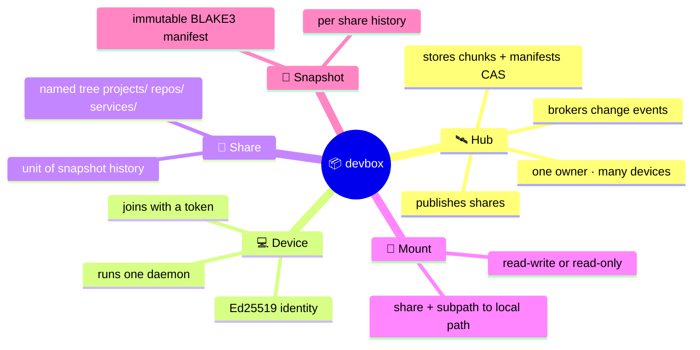
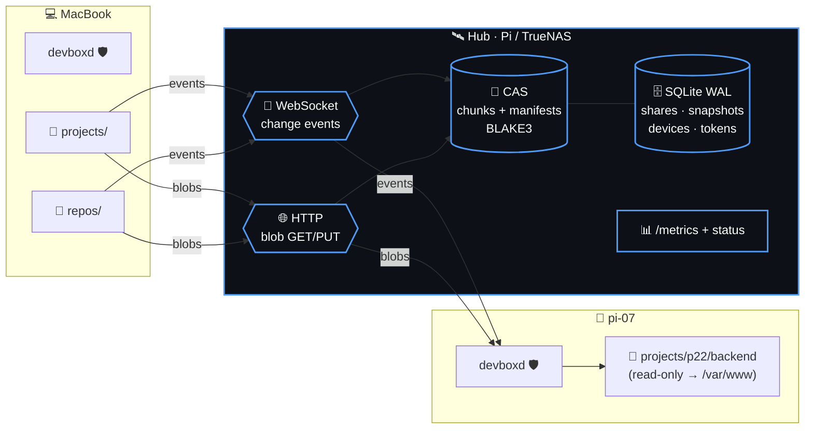
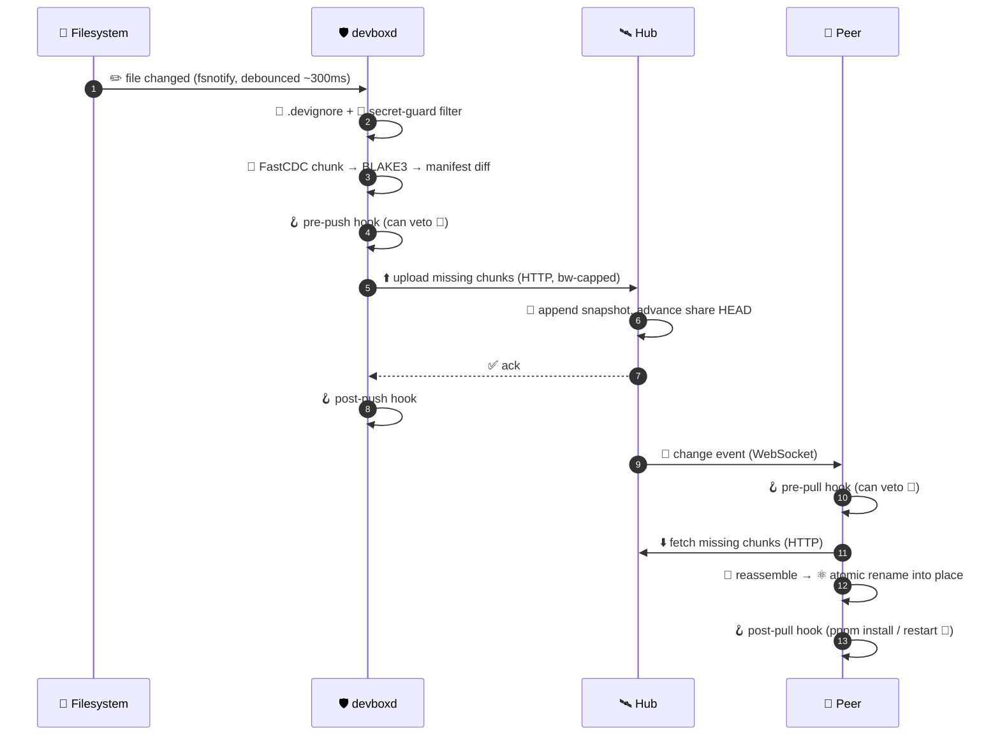
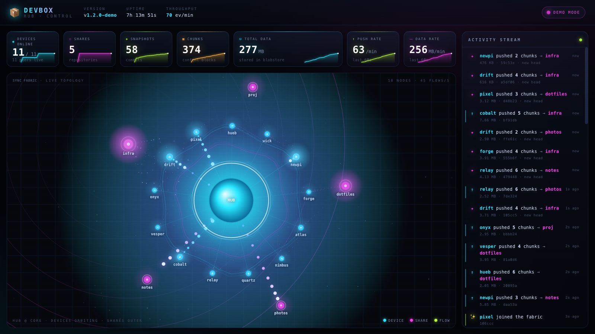
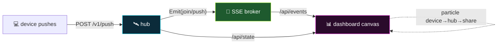
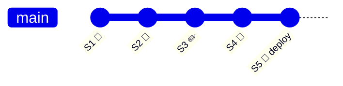
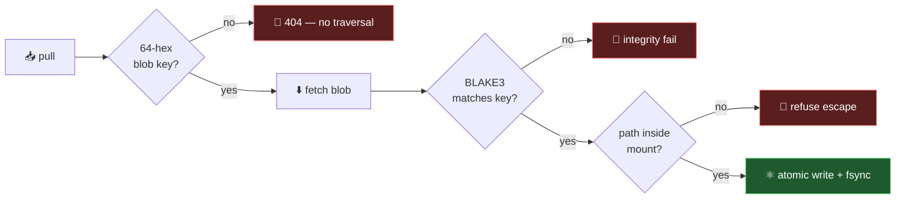
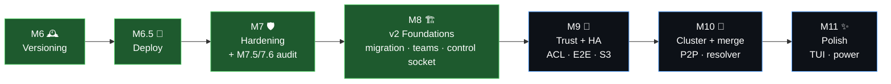

<!-- ════════════════════════════════════════════════════════════════════ -->
<div align="center">


### 📦 **Continuous file sync for developers — like Dropbox, but it respects your `.devignore`, refuses to leak secrets, runs your hooks, and keeps Git-like history.** 📦

<br/>


</div>

<!-- ════════════════════════════════════════════════════════════════════ -->

```
        ╔═══════════════════════════════════════════════════════════╗
        ║   ┌─┐ ┌─┐ ┬  ┬ ┌┐ ┌─┐ ┬ ┬                                 ║
        ║   ││─┤ ├┤  │  │ ├┴┐│ │ │┴┤   sync your dev tree,           ║
        ║   ┴─┘─┘└─┘  └──┘ └─┘└─┘ ┴ ┴   skip the junk, keep history  ║
        ╚═══════════════════════════════════════════════════════════╝
```

> [!NOTE]
> 🎉 **devbox v1 is feature-complete** (M0–M7.6, **fleet-verified on real hardware** —
> Macs + arm64 Pis live-syncing through a hub on a NAS) **and v2 has begun.** 🔮
> The [v1 spec](docs/superpowers/specs/2026-06-22-devbox-design.md) is fully implemented;
> the [v2 spec](docs/V2-SPEC.md) sequences M8→M11 — **M8 foundations are landing now.**
> Star/watch and follow along. ⭐
>
> | Milestone | Status |
> |---|---|
> | M0 — Skeleton (CLI, identity, config) | ✅ done |
> | M1 — Watch · `.devignore` · secret-guard · chunking · manifest | ✅ done |
> | M2 — Hub + one-way push (deployed + verified cross-machine 🛰️) | ✅ done |
> | M3 — Two-way sync · SSE fan-out · 3-way conflict copies · live daemon | ✅ done — **two real Macs sync live through the hub** 🔄 |
> | M4 — Read-only mounts · **sub-path mounts** · bandwidth cap | ✅ done — fleet-verified |
> | M5 — Lifecycle hooks (pre/post push/pull, on-conflict) | ✅ done — **`post-pull` ran on a real fleet node** 🪝 |
> | M6 — Versioning: `log` / `restore` + hub GC | ✅ done — restore reverted a file on the fleet 🕰️ |
> | M6.5 — `devbox deploy` (pin a mount to a snapshot, no push) | ✅ done — **blue/green-deployed v1 on a real box while head stayed v2** 🚀 |
> | M7 — Hardening: `devbox doctor`, reconnect/backoff, rescan fallback, name-clash, release builds | ✅ done — **doctor/stop/hooks + share-name guard + dead-watcher rescan fleet-verified** 🛡️ |
> | M7.5 — Adversarial security/data-loss audit + fixes (path-traversal, blob integrity, never-clobber, safe GC) | ✅ done — **26 findings, all promise-breakers fixed, race-clean** 🔐 |
> | M7.6 — Hardening: fsync durability · DoS caps + timeouts · pidfile PID-reuse guard · join proof-of-possession | ✅ done — fleet-verified on arm64 🛡️ |
> | 🔮 **M8 — v2 Foundations**: migration runner · per-`(share,id)` snapshots · control socket + `pause`/`resume` · **M8a teams** · `restore` byte-safety | ✅ **justified-now scope complete & fleet-verified** (Pi `.13` owner invited an editor, Pi `.15` redeemed & pushed); 3 migrations verified on a copy of the real hub DB. M9–M11 stay demand-driven 🏗️👥 |

---

## 📑 Table of Contents

| | | |
|---|---|---|
| 🤔 [Why devbox?](#-why-devbox) | 🧠 [Core Concepts](#-core-concepts) | 🏗️ [Architecture](#%EF%B8%8F-architecture) |
| 🔄 [How Sync Works](#-how-sync-works) | 💥 [Conflicts](#-conflicts-never-lose-a-byte) | ⚡ [Install & Run](#-install--run) | 🚀 [Quick Start](#-quick-start) |
| 🧰 [CLI Reference](#-cli-reference) | 📊 [Live Dashboard](#-live-dashboard--watch-your-fabric-breathe) | 🪝 [Hooks](#-hooks) | 🙈 [.devignore & Secrets](#-devignore--secret-guard) |
| 🕰️ [Versioning & Deploy](#%EF%B8%8F-versioning--deploy) | 🖥️ [Cross-Platform](#%EF%B8%8F-cross-platform) | 🔐 [Security & Durability](#-security--durability) |
| 🗺️ [Roadmap](#%EF%B8%8F-roadmap) | ⚖️ [License & Open-Core](#%EF%B8%8F-license--open-core) | 🙌 [Contributing](#-contributing) |

---

## 🤔 Why devbox?

You've got a MacBook, a 40-node Pi cluster, and a TrueNAS box. You want your **active working
tree** mirrored across them — *right now*, automatically — without committing half-done work.

Your options today all hurt:

<table>
<tr>
<th>Tool</th><th>The pain 😖</th>
</tr>
<tr>
<td>☁️ <b>Dropbox / iCloud</b></td>
<td>Syncs <i>everything</i> blindly — chokes on <code>node_modules</code>, happily uploads your <code>.env</code>, thrashes on build artifacts.</td>
</tr>
<tr>
<td>🐙 <b>Git</b></td>
<td>Manual. Commit-based. Not built to live-mirror an in-progress working tree. Branching ≠ syncing.</td>
</tr>
<tr>
<td>📁 <b>rsync / scp</b></td>
<td>One-shot, one-direction, no history, no hooks, no conflict safety. You babysit it.</td>
</tr>
<tr>
<td>🔁 <b>Syncthing</b></td>
<td>Great P2P sync — but no <code>.devignore</code> dev-ergonomics, no lifecycle hooks, no snapshot/deploy story.</td>
</tr>
</table>

### ✨ devbox is the missing layer

<div align="center">

| 🎯 | Feature |
|:---:|:---|
| 🔄 | **Continuous bidirectional sync** across all your machines |
| 🙈 | **`.devignore`** (gitignore syntax) — skip `node_modules`, `dist`, the junk |
| 🔐 | **Default-on secret guard** — *hard-refuses* to upload `.env`, keys, secrets |
| 🪝 | **Lifecycle hooks** — `pnpm install` / restart a container when files land |
| 🕰️ | **Git-like snapshots** per share — roll back any file, any time |
| 🎚️ | **Selective mounts** — cherry-pick a share, or *just one sub-path*, per machine |
| 💥 | **Conflict-safe** — never blocks, never asks, **never loses a byte** |
| 🏠 | **Self-hostable** — one Go binary on your Pi/TrueNAS, no SaaS required |
| 🌍 | **Cross-platform** — Linux · macOS · Windows |

</div>

---

## 🧠 Core Concepts



| Term | What it is |
|---|---|
| 🛰️ **Hub** | The server. Publishes shares, stores content-addressed chunks + manifests, brokers events. One owner, many devices. Self-hosted single binary. |
| 💻 **Device** | A machine with an Ed25519 identity, joined to a hub. Runs one daemon (`devboxd`). |
| 📂 **Share** | A named top-level tree on the hub (`projects`, `repos`, `services`). The unit of permission & history. |
| 🔗 **Mount** | A device-side binding: `share[/subpath] → localpath`, read-write or read-only. One daemon watches many. |
| 📸 **Snapshot** | An immutable, per-share manifest version (id = BLAKE3 of the manifest). |

---

## 🏗️ Architecture



> 💡 **Why two channels?** WebSocket for live events (tiny, ordered) + **stateless HTTP for
> blobs** (`GET /blob/<hash>` → range/resume/caching for free). Same TLS endpoint, same token.
> Pure-WebSocket would force us to reinvent resumable transfer over a socket — *more* code.

---

## 🔄 How Sync Works



A **read-only** mount skips steps 1–8 (it never pushes) but still receives and applies inbound
changes. 🔒

---

## 💥 Conflicts: Never Lose a Byte

devbox is **Dropbox-easy** (never nags you mid-work) **and** data-loss-proof. Here's the magic:
the hub keeps a **linear HEAD per share**, and every push declares the snapshot it was based on.


<details>
<summary>📖 <b>The classic "laptop was offline" scenario — click to expand</b></summary>

<br/>

Both machines synced at snapshot `S3`, both have `foo.go` v1:

1. 🔌 **Laptop goes offline**, edits `foo.go` → **v2-laptop** (queued, parent still `S3`).
2. 🍓 **Pi (online)** edits the same `foo.go` → **v2-pi**, pushes. Hub HEAD `S3 → S4`. Pi's wins canonical.
3. 🔌 **Laptop reconnects**, pushes with `parent=S3` — but HEAD is `S4`. `parent ≠ HEAD` → conflict path.
4. 🔱 Both changed `foo.go` since `S3` → real conflict.
5. 🛟 **Result, nothing destroyed:** both machines end up with
   `foo.go` = **v2-pi** (canonical) **and** `foo.conflict-laptop-1719.go` = **v2-laptop** beside it.

The offline edit is **never lost** — it just lands as a clearly-named sibling. 🎯

</details>

**Conflict rules at a glance:**

| Situation | Outcome |
|---|---|
| 🤝 Both edit same file | First-to-land canonical; loser → `.conflict-<host>-<ts>` copy |
| 🗑️ One deletes, one edits | **Edit always wins** — a delete has no bytes to lose |
| 🔤 Rename | Free — old-gone + new-added; content-addressed = zero re-transfer |
| 🔒 Read-only mount about to clobber a local edit | Local stashed as `.conflict-local-<ts>` first |
| 👀 You find out via | `devbox status` badge · `on-conflict` hook · `devbox conflicts` list |

> 🚫 **No blocking prompts.** A headless daemon can't prompt you, and nagging would break the
> whole "Dropbox-easy" promise. You get told; you choose when to look.

---

## ⚡ Install & Run

**Client (macOS / Linux)** — one line. Detects your platform, lets you pick where the binary lives, and offers a **keep-alive auto-restart service** (launchd `KeepAlive` on mac, systemd `Restart=always` on Linux):

```bash
curl -fsSL https://git.shoemoney.ai/shoemoney/devbox-dist/releases/download/latest/install.sh | sh
# non-interactive: DEVBOX_BIN_DIR=~/.local/bin DEVBOX_SERVICE=1 sh install.sh
# also install the hub: sh install.sh --hub
```

<details><summary>🪟 Windows · 🍎 macOS Full Disk Access · 🛠️ knobs</summary>

- **Windows:** `irm https://git.shoemoney.ai/shoemoney/devbox-dist/releases/download/latest/install.ps1 | iex` — copies `devbox.exe`, adds it to PATH, and (optionally) a restart-on-failure **Scheduled Task** at logon. Notes Controlled Folder Access if you have it on.
- **From Go (have a toolchain):** `go install github.com/shoemoney/devbox/cmd/devbox@latest` (hub: `…/cmd/devbox-hub@latest`).
- **macOS Full Disk Access:** to sync `~/Desktop`, `~/Documents`, `~/Downloads`, or **iCloud**, grant Full Disk Access to the `devbox` binary (System Settings → Privacy & Security → Full Disk Access). `devbox doctor` tests your actual mounts and tells you the exact fix + a deep link — a background daemon can't show the per-folder prompt, so without it those mounts silently fail.
- **Knobs:** `--bin-dir DIR` · `--hub` · `--service` / `--no-service` · `--release-url URL` (or the `DEVBOX_*` env equivalents). No prebuilt release? The script falls back to a local `dist/` (run `scripts/build-release.sh`) or `go build`.
- **Service control:** `systemctl --user {status,disable} devbox` (Linux) · `launchctl unload ~/Library/LaunchAgents/ai.shoemoney.devbox.plist` (mac).

</details>

**Hub on a NAS (TrueNAS / Synology / unRAID / any Docker host)** — self-healing container, drop-in:

```bash
docker compose up -d --build                          # hub on :8088, data persisted, restart: unless-stopped
docker compose exec hub devbox-hub token --data /data # mint a join token
# live dashboard: uncomment the :8099 port + --dashboard command in docker-compose.yml
# stronger self-heal (restart on unhealthy): docker compose --profile selfheal up -d
```

The image is a tiny (~32 MB) static, non-root Alpine build — `Dockerfile` + `docker-compose.yml` at the repo root.

<details>
<summary>🔒 <b>Production: TLS + safe upgrades</b></summary>

**Put the hub behind TLS.** The hub speaks plain HTTP and the bearer token + your file bytes cross the wire in the clear — front it with a reverse proxy (nginx / Caddy / Nginx Proxy Manager) and terminate TLS there (the API is bearer-authed). Two settings a *sync* hub needs in the proxy:

```nginx
location / {
    proxy_pass http://<hub-host>:8088;
    client_max_body_size 0;     # large blob uploads — never cap them
    proxy_buffering off;        # stream the /v1/events SSE to clients
    proxy_read_timeout 3600s;   # long-lived event stream
}
```
Devices then `devbox join https://hub.example.com <token>` — Go's client does TLS natively.

**Upgrade safely.** The hub DB is the canonical index to every share's history, so don't hot-swap the binary. `deploy/redeploy-hub.sh` runs the never-YOLO pipeline: **migration dry-run on a *copy* of live data** (`scripts/verify-hub-migration.sh`) → **auth smoke** the new binary in a throwaway instance (`scripts/hub-auth-smoke.sh`) → back up binary + DB → swap → verify the new code is live → **auto-rollback** on any failure. (`--gc-every <dur>` self-maintains so blobs don't accumulate.)
</details>

---

## 🚀 Quick Start

> ✅ *Every command below is implemented and fleet-tested. Build with `scripts/build-release.sh`.*

```bash
# 🛰️  On your hub (Pi / TrueNAS / NAS)
devbox-hub serve --data /srv/devbox --listen 0.0.0.0:8088
devbox-hub token                                # prints a one-time join token

# 💻  On your laptop
devbox join http://hub.lan:8088 <token>         # enroll this machine
devbox publish ~/Projects projects              # create a share from a folder
devbox start                                    # live-sync daemon (foreground)

# 🍓  On another machine — clone the share and keep it in sync
devbox join http://hub.lan:8088 <token>
devbox mount projects ~/Projects                # clone + register the mount
devbox start

# 🚀  A read-only deploy box — pulls, never pushes its runtime cruft back up
devbox mount api /var/www/api --ro
devbox start
```

That's it. ✨ Edit on your laptop → it lands on the Pi in near-real-time, `node_modules` stays
home, your `.env` *never leaves the building*, and `post-pull` can `pnpm install` + restart your
container automatically. 🪄

---

## 🧰 CLI Reference

<details open>
<summary>💻 <b>Device commands</b></summary>

| Command | What it does |
|---|---|
| `devbox setup` | 🧭 Step-by-step first-run wizard (also auto-offered once on a fresh machine; opt out with "don't ask again") |
| `devbox join <hub> <token>` | 🎟️ Enroll this device against a hub |
| `devbox mount <share> <dir>` | 🔗 Mount a share into a local dir (clone + sync) |
| `devbox mount <share> <dir> --ro` | 🔒 Mount **read-only** (pull only, never push) |
| `devbox mount … --exclude <pat>` | 🙈 Device-local ignore (gitignore syntax, repeatable) layered on the shared `.devignore` — e.g. skip a local build dir |
| `devbox publish <dir> <name>` | 📂 Create a share from a local folder + push it |
| `devbox unmount <share>` | ⏏️ Stop syncing a mount (files stay on disk) |
| `devbox start` / `stop` | ▶️⏹️ Run / stop the daemon |
| `devbox status` `[--json]` | 📊 Device, hub, mounts (with `ro`/`pinned`); `--json` for scripting (prefers live daemon state) |
| `devbox log <share>` `[--json]` | 🕰️ Snapshot history (full ids); `--json` for machine-readable output |
| `devbox restore <share> <snap> [path]` | ↩️ Roll back a file or a whole share |
| `devbox deploy <share> <snap>` | 🚀 Pin a mount to a snapshot — applies it without pushing (blue/green) |
| `devbox conflicts` `[--json] [--rm]` | 💥 List conflict copies across all mounts; `--json` emits a JSON array, `--rm` deletes them (review first!) |
| `devbox ignore <pattern>` | 🙈 Append a pattern to `./.devignore` |
| `devbox hook edit <share> <event>` | 🪝 Scaffold/open a hook in `$EDITOR`; `hook list <share>` shows installed |
| `devbox doctor` `[--json]` | 🩺 Diagnose watcher limits, perms, bash, hub connectivity + bearer + **clock skew vs hub** (warns >30s); non-zero exit on ❌ — cron-friendly; `--json` for monitoring |
| `devbox status` shows sync age | ⏱️ Live status now prints per-mount last-sync age ("synced 12s ago" / "not synced yet") |
| `devbox pause [--for <dur>]` / `resume` | ⏸️▶️ Suspend/resume the running daemon's syncing via its control socket; `--for 2h` auto-resumes (M8) |
| `devbox invite <share> <principal> <role>` | ✉️ Mint an invite token granting a role (`--reshare` for `+s`); attenuation-enforced (M8a) |
| `devbox invite revoke <token>` | 🗑️ Kill a pending invite before it's redeemed (only a caller who could mint it) |
| `devbox members <share>` | 👥 Show who can access a share, or "legacy share" (M8a) |
| `devbox-hub member set/rm/list` · `principal` | 🛡️ Hub-side role admin (M8a) |
| `devbox peers` | 🌐 *Planned — needs a hub peers endpoint (M10)* |

</details>

<details>
<summary>🛰️ <b>Hub commands</b> (run on the hub host)</summary>

| Command | What it does |
|---|---|
| `devbox-hub serve --config <file>` | 🚀 Start the hub |
| `devbox-hub token` | 🎟️ Mint / rotate the join token |
| `devbox-hub device ls` `[--json]` · `revoke <id>` | 📋❌ List enrolled devices (id/name/principal/last-seen/revoked) / revoke one |
| `devbox-hub readonly <device> <share>` | 🔒 Mark a device read-only on a share |
| `devbox-hub member set/rm/list` · `principal` | 🛡️ Per-share roles + principals (M8a) |
| `devbox-hub backup <dir>` | 💾 Disaster-recovery snapshot: consistent DB copy (`VACUUM INTO`) + the blob tree into `<dir>` |
| `devbox-hub serve --dashboard` | 📊 Serve the live web dashboard (loopback `:8099` by default) |
| `devbox-hub serve --dashboard-token <tok>` | 🔐 Require a token to view the dashboard (recommended for any non-loopback bind) |
| `devbox-hub serve --metrics-token <tok>` | 🔐 Require a token for `/metrics` — close the unauthenticated leak on a WAN-exposed hub |
| `devbox-hub serve --access-log` | 📝 Log one line per request (method, path, status, bytes, addr) for WAN forensics |
| `devbox-hub serve --gc-every <dur>` | 🧹 Opt-in in-process periodic GC (off by default; each sweep animates on the dashboard) |
| `devbox-hub gc [--dry-run] [--keep <n>] [--keep-days <n>]` | 🧹 GC unreferenced chunks; `--dry-run` previews, `--keep` keeps N newest/share, `--keep-days` also keeps anything from the last N days |
| `GET /healthz` · `GET /readyz` | 🩺 Liveness (`/healthz` reports the build version) / readiness (`/readyz` pings the DB → 503 if unreachable) for Docker/LB |
| `GET /metrics` | 📊 Prometheus: gauges (devices/shares/snapshots/chunks) + counters (blob bytes in/out, pushes, conflicts); gate with `--metrics-token` |

</details>

---

## 📊 Live Dashboard — watch your fabric breathe

> Our own. No Grafana, no Prometheus required, **no external deps** — it ships *inside the hub binary*
> and runs air-gapped. **Off by default**; flip it on and watch every push, join, and chunk flow in real time. ✨

<p align="center"></p>

```bash
devbox-hub serve --dashboard                       # loopback http://127.0.0.1:8099 (safe default)
devbox-hub serve --dashboard --dashboard-addr 0.0.0.0:8099   # expose on the LAN (unauthenticated — warns you)
devbox-hub serve --dashboard --gc-every 24h        # also self-maintain (in-process GC) — each sweep animates
```

A mission-control flow visualization rendered on `<canvas>` at 60fps: a **breathing hub core**, your
**devices orbiting** (bright = active), **shares** on the outer ring — and the fabric comes alive with **five
flow events**: `push` (device → hub → share, fans out to subscribers), `pull` (a calm teal pulse inbound as a
device syncs), `conflict` (a red collision burst when a stale push is rejected), `gc` (an amber hub-wide sweep
+ toast when garbage-collection runs), and `join`. Plus live **metric tiles** and a **server-side history
sparkline** (stacked push/pull/conflict/gc per minute, last hour) that **survives a page reload**, and a
streaming, color-coded **activity feed**.

| How it works | |
|---|---|
| 🖥️ **Served from the hub** | single `go:embed`'d HTML, vanilla JS + canvas, zero CDN/build |
| 🔌 **`GET /api/state`** | snapshot: hub, totals, devices, shares + a 60-minute `history` window (UI polls every 10s) |
| 📡 **`GET /api/events`** | SSE live flow stream (`join` · `push` · `pull` · `conflict` · `gc`) — the dashboard animates each one |
| 🔒 **Loopback by default** | unauthenticated read-only metrics; bind non-loopback only deliberately (it warns) |
| 🎬 **`?demo=1`** | synthesizes a live stream of all five event types — instant wow + works offline (`file://`) |



---

## 🪝 Hooks

Drop executable scripts in `<mount>/.devbox/hooks/`, named after the event. **bash everywhere**
(a `.ps1` hook auto-runs via `pwsh` on Windows 🪟). `pre-*` non-zero exit **aborts** the step.
60s timeout — a hung hook is killed, never wedges the loop. ⏱️

| Hook | Fires | Abort? | Typical use |
|---|---|:---:|---|
| `pre-push` | before upload | ✅ | 🧹 lint/format, secret scan |
| `post-push` | after upload | ❌ | 📣 notify, log, tag a snapshot |
| `pre-pull` | before apply | ✅ | 🛑 stop a container / dev server |
| `post-pull` | after apply | ❌ | 📦 `pnpm install`, migrate, restart |
| `on-conflict` | conflict copy made | ❌ | 🔔 open a diff, ping you, log |

```bash
#!/usr/bin/env bash
# .devbox/hooks/post-pull  —  reinstall deps + restart only when needed
if grep -qE 'package\.json|pnpm-lock\.yaml' "$DEVBOX_CHANGED_FILES"; then
  pnpm install --frozen-lockfile
fi
docker compose restart app   # 🚀
```

<details>
<summary>🌱 <b>Injected environment variables</b></summary>

```bash
DEVBOX_EVENT=post-pull
DEVBOX_MOUNT=/srv/project
DEVBOX_SHARE=projects
DEVBOX_HOST=pi-node-07
DEVBOX_CHANGED_FILES=/tmp/devbox-changes.txt   # newline-delimited
DEVBOX_SNAPSHOT=ab12cd34
DEVBOX_REMOTE=hub.shoemoney.ai
```

</details>

---

## 🙈 .devignore & Secret Guard

### 🙈 `.devignore` — gitignore syntax, shared at the share root

```gitignore
node_modules/      # 📦 the usual suspects
dist/  build/  .next/  target/
*.log  *.tmp  .DS_Store
!.env.example      # ❗ negate to force-include
```

Matched paths are **invisible to sync in both directions**. Change it → rescan; newly-ignored
files are **left on disk** (never deleted), they just stop syncing.

### 🔐 Secret Guard — *always on, independent of `.devignore`*

> [!IMPORTANT]
> Your pitch is "won't leak your `.env`" — so devbox **enforces it**. A built-in deny-list runs
> in the push path and **hard-refuses to upload** matched files *even if `.devignore` is
> misconfigured.* Belt **and** suspenders. 🩲

Default-blocked: `.env` · `.env.*` (except `.env.example`) · `*.pem` · `*.key` · `id_rsa*` ·
`*.p12` · `*.pfx` · `secrets/` · `*.kdbx` · common cloud-cred files. Blocked files show up in
`devbox status`. Add your own via `[secrets].extra_patterns` in `config.toml`.

<details>
<summary>⚙️ <b><code>config.toml</code> — per-machine tunables</b></summary>

```toml
[transfer]
max_kbps  = 0     # blob transfer cap (KB/s); 0 = unlimited
compress  = false # 🌐 gzip blobs BOTH ways (upload + download) — turn on for devices syncing over a WAN link

[sync]
rescan_seconds  = 60    # watcher-fallback rescan cadence; raise on a huge tree, lower for snappier convergence
ignore_defaults = false # 🙈 also ignore common junk (node_modules, .git, target, dist, build, .venv, __pycache__, …)

[secrets]
extra_patterns = ["*.secret", "vault-*"] # additional secret-guard deny patterns
```

> `compress` only gzips a chunk when it actually shrinks (incompressible blobs go raw), and the
> hub hashes the **decompressed** bytes so dedup + integrity are untouched. 🗜️ The WAN path is also
> hardened with granular timeouts, automatic retry+backoff on transient blips, and parallel blob
> transfer — no flags, always on.

</details>

---

## 🕰️ Versioning & Deploy



- 📸 Every accepted change = an **immutable snapshot** (BLAKE3 of the manifest). Manifests are
  themselves content-addressed → 100 pushes don't store the tree map 100×.
- ↩️ `devbox restore <snap> [path]` rolls back a file or whole share (itself a new change →
  reversible).
- 🚀 `devbox deploy <share> <snap>` pins a mount to a snapshot by **applying it without pushing a
  new head** — history stays untouched and the daemon won't drag it back to latest (`[pinned]`).
  **Blue/green deploys** for your `/var/www` boxes, basically free; re-mount to resume live sync.
- 🧹 `devbox-hub gc` sweeps unreferenced chunks (refcounted).

---

## 🖥️ Cross-Platform

<div align="center">

| Capability | 🐧 Linux | 🍎 macOS | 🪟 Windows |
|---|:---:|:---:|:---:|
| File watching | inotify | FSEvents | ReadDirectoryChangesW |
| Atomic apply | `rename(2)` | `rename(2)` | `ReplaceFile`/`MoveFileEx` |
| Hooks | bash | bash | bash *(git-bash/WSL)* or `.ps1`→pwsh |
| Service | systemd | launchd | Windows Service |
| Static binary | ✅ | ✅ | ✅ |

</div>

> 🧭 Canonical paths are **forward-slash + relative** (converted at the Windows boundary).
> Filenames illegal/colliding on an OS (`foo.go` vs `Foo.go`, `aux`, trailing dot) → **skip +
> warn + surface** in `devbox status`; the hub keeps the bytes, peers that *can* hold the name
> still get the file. Never fatal. 🛟

---

## 🔐 Security & Durability

> Threat model: **single-owner, multi-device** (every enrolled device is *yours*). Within that,
> v1 went through an adversarial audit — every data-loss and arbitrary-file path is closed. 🛡️

| Layer | Protection |
|---|---|
| 🪪 **Device identity** | ed25519 keypair per device; `join` requires **proof-of-possession** (a signed challenge — you can't claim a key you don't hold), and a bad request never burns the one-time token |
| 🎟️ **Auth** | bearer tokens, **hashed at rest** (hub stores no plaintext creds), device-**revocable** |
| 🧊 **Content integrity** | every chunk **and** manifest is re-verified against its BLAKE3 hash on download — a corrupt/truncated transfer or hostile hub can't write wrong bytes into your tree |
| 🚧 **Path safety** | hub rejects any blob key that isn't 64-hex (no `..%2f` traversal → no arbitrary file read); the client refuses manifest paths that escape the mount root |
| 🔑 **Secret guard** | case-insensitive deny-list (`.ENV` == `.env`); `.env`/keys/`*.env`/`.aws/credentials` **never leave the machine**, independent of `.devignore` |
| 🛟 **Never lose a byte** | losing local edits become `.conflict` copies; ignored/guarded on-disk files are preserved **before** any hub overwrite; atomic writes are **fsync'd** (power-loss safe) |
| 🧹 **Safe GC** | mark-and-sweep from every live head — never frees a chunk a share still needs, even if refcounts are off |
| 🚪 **DoS bounds** | request-body caps (256 MiB blob / 8 MiB JSON → `413`) + server read/idle timeouts |
| 🆔 **Daemon** | single-instance pidfile with a **PID-reuse guard** (start-time token) so `stop` never signals a stranger |

<details>
<summary>🔬 how the integrity + path guards chain</summary>


</details>

---

## 🗺️ Roadmap

> 🔮 **Looking ahead:** the full **[v2 design spec](docs/V2-SPEC.md)** — multi-owner teams + ACLs,
> client-side E2E encryption (convergent, keeps dedup), LAN peer chunk-exchange + hub HA, 3-way merge,
> and a TUI — sequenced M8→M11 by dependency. **M8 foundations are landing now**; M9–M11 stay
> demand-driven (build E2E when an untrusted-hub user exists, P2P when the uplink hurts, the TUI when asked).



| | Milestone | Deliverable |
|:---:|---|---|
| ✅ | **M0 — Skeleton** 🦴 | cobra CLI, `devbox join`, keypair, machine config |
| ✅ | **M1 — Watch + secrets** 👀 | fsnotify, `.devignore`, secret-guard, FastCDC+BLAKE3 chunking, content-addressed manifests |
| ✅ | **M2 — Hub + push** 🛰️ | shares, join tokens, CAS, `publish`, HTTP upload, snapshots, bearer auth, `/metrics` — deployed on `.10`, verified cross-machine |
| ✅ | **M3 — Two-way sync** 🔄 | SSE event fan-out, `mount`, pull + atomic apply, per-file 3-way conflict copies, live `start` daemon — **two Macs sync live through the hub** |
| ✅ | **M4 — Read-only + bw** 🔒 | server-enforced read-only bit, **sub-path mounts** (`mount proj/app /dir`), bandwidth cap — fleet-verified |
| ✅ | **M5 — Hooks** 🪝 | bash (+`.ps1`) lifecycle runner, env injection, 60s timeout, `pre-*` veto — `post-pull` fired on a fleet node |
| ✅ | **M6 — Versioning** 🕰️ | `devbox log` (full snapshot ids) / `restore` (revert any file) / hub `gc` — fleet-verified |
| ✅ | **M6.5 — Deploy** 🚀 | `devbox deploy <share> <snapshot>` — apply a snapshot without pushing, `[pinned]` mount; fleet-verified blue/green |
| ✅ | **M7 — Hardening** 🛡️ | `devbox doctor`, `stop`/pidfile, `hook edit/list`, SSE backoff+jitter, **60s rescan fallback** (survives dead/limited inotify watchers — PRD risk #1), share-name guard, release builds — fleet-verified |
| ✅ | **M7.5 — Audit hardening** 🔐 | adversarial security/data-loss audit + fixes: blob-hash **path-traversal** blocked, **download blob-integrity** check, manifest-path **containment**, secret-guard **case-insensitive** + more patterns, **never-clobber** ignored/guarded files, **GC made safe** vs cross-share refcount undercount — all with regression tests, race-clean, fleet-verified |
| ✅ | **M7.6 — Hardening complete** 🛡️ | 💽 **fsync durability** on atomic writes (power-loss safe), 🚪 **request size caps + server timeouts** (DoS), 🆔 **pidfile PID-reuse guard** (start-time token), 🪪 **join proof-of-possession** (ed25519 signature, token not burned on a bad request) — fanned out to parallel worktree agents, regression-tested, race-clean, fleet-verified |
| ✅ | **M8 — v2 Foundations** 🏗️ | 🔑 **schema migration runner** (`PRAGMA user_version`, transactional, `VACUUM INTO` backup, refuses a newer DB) · 🔢 **per-`(share,id)` snapshots** (fixes the cross-share refcount undercount; GC + head-backfill reworked) · 🎛️ **daemon control socket** (Unix socket, HTTP/1.1, `0600`) wiring `devbox pause`/`resume` + live-socket-aware `status` · 👥 **M8a: principals + per-share roles + write enforcement** (`devbox-hub member`/`principal`; legacy shares = v1, first grant flips to deny-by-default; role≥editor AND the writable clamp). **Both migrations verified on a copy of the real `.10` hub DB** (counts preserved, 3 legacy heads repaired, chains 0→1→2). 👀 read side (`GET /v1/members` + `devbox members`) · ✉️ **device-facing invites** (`POST /v1/invite` + `devbox invite`, privilege **attenuation** via pure `meta.MayGrant`, self-seed on the legacy→explicit flip) — **cross-machine fleet-verified on arm64 Pis** · 🛟 **`restore` preserves uncommitted edits** (never-lose-a-byte on revert). **M8's justified-now scope is complete** — the conflict sidecar moves to M10 (only its resolver consumes it) and read-side ACL gating is M9 |

<details>
<summary>🔮 <b>still ahead in M8 / genuinely v2</b></summary>

Landed in M8 above: the migration runner, per-`(share,id)` snapshots, and the control socket. Still sequenced ahead:

- 📝 **Conflict-copy on explicit `restore`/`deploy`** *(M8-3)* — needs base/ancestor awareness so it preserves only *uncommitted* edits without breaking restore-reproduces-snapshot; rides the conflict **sidecar**.
- 👥 **Principals / roles / invites + write enforcement** *(M8a)* — the membership layer E2E + P2P both need underneath them.
- 🔑 **Read-side ACL + deny-by-default writes** *(M9)* — only meaningful once shares span *multiple owners*; the genuinely new attack surface, staged after write-side.
- 🔢 **`snapshot_chunks` edge table** *(M9)* — a derived-refcount source for E2E/P2P; deferred until a consumer exists (the migration runner makes adding it a one-liner).

</details>

<details>
<summary>🔮 <b>v2 backlog</b></summary>

- 🤝 **LAN peer chunk-exchange** — co-located nodes swap chunks directly (Syncthing-style)
- 🎛️ **Interactive conflict resolver** — diff + keep-mine/theirs/both/edit
- 🔁 **Re-share / delegation** (the `s` permission)
- 🧬 **Content-level 3-way text merge**
- 🔋 **Laptop power sanity** — pause-on-metered / pause-on-battery / sync windows
- 🔏 **Client-side E2E chunk encryption**
- 🏰 **Hub clustering / HA**
- 🖼️ **Full TUI** dashboard

</details>

---

## ⚖️ License & Open-Core

<div align="center">

**📜 AGPLv3 core** — self-host free, forever. &nbsp;·&nbsp; **💼 Commercial license** for the hosted tier.

</div>

devbox is **open-core**: the entire hub + clients in this repo are AGPLv3 and fully
self-hostable. A future **hosted version** (signup, billing, provisioning) is a separate, closed
control plane that wraps the same single-tenant hub — designed for via clean seams (`BlobStore`
interface, config-driven limits, `/metrics`) but **not part of this OSS repo**.

> Offering devbox as a hosted service? AGPLv3 means open your changes — or
> [grab a commercial license](#). 🤝

---

## 🙌 Contributing

> ✅ v1 is feature-complete — the [spec](docs/superpowers/specs/2026-06-22-devbox-design.md)
> documents the full design, and `scripts/build-release.sh` cross-compiles every platform.

1. 🍴 Fork & branch
2. 🧪 Keep it lazy-correct (smallest diff that works, tests for non-trivial logic)
3. 📝 Update the docs in the same PR — they get the **full flare treatment** 😎
4. 🚀 Open a PR

<div align="center">
<br/>

### Made with 📦, ☕, and a healthy fear of `rm -rf` on the wrong machine.

*“It's like Dropbox, but it actually respects that you're a developer.”* 💙

</div>
