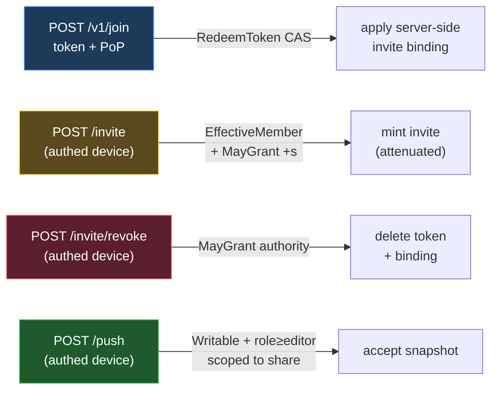

<!-- ════════════════════════════════════════════════════════════════════ -->

# 🛡️ M8a Auth — Adversarial Security Audit

*The M7.5 treatment for v2's new privilege surface — before anyone relies on it for multi-owner shares.*

> **Date:** 2026-06-23 · **Method:** 6 parallel adversarial finders (one per attack class) + a
> per-finding skeptic verification pass + a full manual read of the auth path. **13 agents**,
> 5 candidate findings confirmed by the verifiers, then triaged by severity & exploitability:
> **2 fixed** with regression tests, **3 documented** as accepted residuals of the single-owner
> trust model. The auth core held up well — 20 distinct defenses were positively confirmed.

---

## 🎯 Threat model

devbox's hub is **single-owner-first**: you self-host it on hardware you control, so the hub is
trusted. M8a adds **multi-principal shares**, so the new attack surface is **a malicious _client_**
trying to exceed its granted role. Every privilege decision is therefore re-checked **server-side**;
the client is never trusted for its own role.

---

## 🔬 Findings

| # | Class | Verdict | Disposition |
|---|---|---|---|
| 1 | Invite is an unrevocable bearer capability | 🟠 real (med) | **FIXED** — added `/v1/invite/revoke` |
| 2 | Invite could confer `+s` the caller lacks | 🟠 real (attenuation gap) | **FIXED** — `MayGrant` now attenuates `+s` |
| 3 | Push gate read not in the snapshot write's lock | 🟡 low | accepted residual |
| 4 | SSE stream not torn down on revocation | 🟡 low | accepted residual |
| 5 | Invite token = bound-principal bearer (theft = takeover) | 🟡 inherent | mitigated by #1 + TLS |
| — | Single-use redeem, role bounding, revoke-at-auth, cross-share binding, PoP | ✅ defended | 20 defenses confirmed |
| — | "non-transactional join orchestration" | ⚪ refuted | crash-window only, no privilege effect |

### 🛠️ FIXED #2 — `+s` (reshare) attenuation gap
`MayGrant` validated the granted **role** and the target, but **never the granted `+s` bit** —
`handleInvite` copied `req.Reshare` (the client `--reshare` flag) straight into the binding. Not a
live escalation today (a granter always out-ranks the grantee, so the grantee never exceeds the
granter), but the `+s` dimension was **unattenuated** and would become a real hole if the role
hierarchy ever changed. **Fix:** `MayGrant(..., grantReshare bool)` now rejects conferring `+s`
unless the caller holds it (owners unconstrained) — attenuation is total over all three dimensions.
*Tests:* `TestMayGrant` (+5 cases) · `TestInviteCannotGrantReshareCallerLacks` (HTTP).

### 🛠️ FIXED #1 & #5 — invites were unrevocable bearer capabilities
An invite is a 24h single-use token that binds a **specific principal+role**. There was **no way to
kill one** — a leaked or regretted invite (or one minted before the inviter was demoted) stayed
redeemable for its whole TTL, and whoever held the string could claim that principal's role.
**Fix:** added `meta.RevokeInvite` (deletes token+binding in one tx) + `POST /v1/invite/revoke` +
`devbox invite revoke <token>`. Only a caller who could have **minted** it (same `MayGrant`
authority on the bound share) may revoke it. *Test:* `TestInviteRevoke` (revoke → redeem fails;
re-revoke is a no-op; a viewer can't revoke an editor invite, and the invite survives that attempt).

### ✅ Confirmed defenses (held under attack)
- **Single-use redeem:** `RedeemToken` is an atomic compare-and-set (`UPDATE … SET used=1 WHERE used=0 AND not-expired`); sequential **and** concurrent double-redeem both fail. PoP is checked *before* redeem, so a bad request can't burn a token.
- **Role bounding:** caller role/`+s` are server-derived (`EffectiveMember`), never from the request; you can't grant above your own role or touch a principal who out-ranks you.
- **Revocation at auth:** `DeviceByBearer` **and** `EffectiveMember` filter `revoked=0`, so a revoked device is denied on the **next request** — no cached credential survives.
- **Cross-share:** redemption binds share/principal/role from the **server-side binding**, never the joiner's request body; an A-invite can't confer B-rights. Write-gate is scoped to `req.Share`.
- **Write-gate:** `!writable || role < RoleEditor → 403`, deny-by-default on explicit shares.

---

## 🧭 Accepted residuals (single-owner threat model — by design)

Not bugs — documented edges of the current trust model, deferred until a concrete consumer appears:

- **#3 Push micro-TOCTOU:** the write-gate's role read isn't in the same lock as the snapshot write,
  so a write started a microsecond before a concurrent legacy→explicit flip could still land.
  Accepted: the actor *had* access an instant earlier, and serializing every push to close a µs
  window isn't worth the throughput. Revocation is eventual on the next request regardless.
- **#4 SSE revocation lag:** a revoked device keeps receiving share-*change notifications* (not data)
  on an already-open event stream until it disconnects. Tied to the **M9 read-side-ACL** deferral —
  reads aren't role-gated yet (single-owner trust). Writes **are** closed immediately.
- **Read-side ACL (M9):** `handleHead`/`handleLog`/`handleGetBlob`/`handleMembers` don't gate reads
  by role. Deferred until a genuinely untrusted multi-owner share exists.
- **Legacy multi-principal lockout:** the first invite on a legacy share seeds only the *caller's*
  principal as owner; other distinct principals on that legacy share lose access on the flip.
  Acceptable under the single-owner assumption a legacy share carries.
- **Invite theft within TTL (#5):** invites are bearer secrets (like any invite link); TLS to the
  hub + the new revoke primitive + the 24h TTL bound the exposure. A network MITM of the join
  request is out of scope (TLS assumed).

---

## 🧪 Regression coverage

| Invariant | Test | State |
|---|---|---|
| `+s` can't be conferred by a caller who lacks it | `TestMayGrant`, `TestInviteCannotGrantReshareCallerLacks` | 🆕 fails pre-fix |
| pending invite is revocable; only by an authorized caller | `TestInviteRevoke` | 🆕 fails pre-fix |
| redeemed invite token can't be reused | `TestTokenRedeemOnce` | ✅ pre-existing |
| caller can't grant above their role / demote a superior | `TestMayGrant` | ✅ pre-existing |
| write-gate denies viewers/unmembered/revoked | `TestPushWriteGate` | ✅ pre-existing |
| join requires proof-of-possession | `TestJoinRequiresProofOfPossession` | ✅ pre-existing |

All green, `go test ./... -race` clean (18 packages).

---

*Six finders, thirteen agents, two real holes closed — the write-gate held the whole time. 🛡️*

