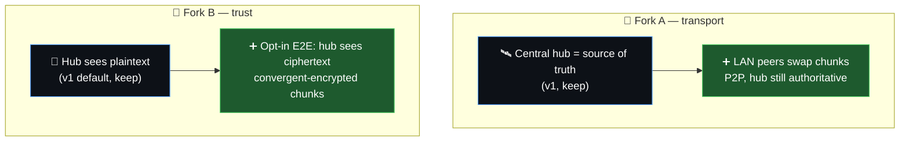
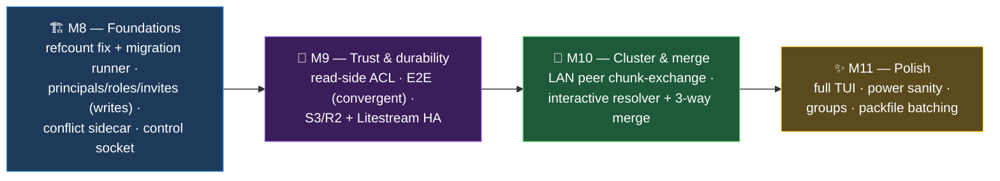

<div align="center">

# 🔮 devbox v2 — Design Spec

**From a single-owner sync tool → trusted, multi-person sync at cluster scale — still 100% self-hostable.**


-00ADD8?style=for-the-badge)

</div>

> 📋 This is the v2 **design spec**. v1 (M0–M7.6) is complete, audited, and hardened; **M8
> foundations are now landing on `main`** (see the ✅ marks in §5 and the roadmap). M9–M11 stay
> captured-not-committed — demand-driven, built when a real user needs them. Every v2 change is
> additive: the v1 CLI + hook contract is sacred.

---

## 1. 🎯 Vision

devbox v1 nailed the **single-owner, multi-device** loop: your laptop, your Pi cluster, your
homelab — live-synced, secret-safe, never-lose-a-byte. v2 grows along three axes **without
betraying that simplicity**:

| Axis | v1 | v2 |
|---|---|---|
| 👥 **Who** | one owner, many devices | many people / teams, per-share read+write ACLs + delegation |
| 🔒 **Trust** | hub sees plaintext | optional client-side **E2E encryption** — hub stores only ciphertext |
| 📈 **Scale** | one hub, every node pulls from it | **LAN peer chunk-exchange** (P2P) + **hub HA** + S3/R2 blobs |

…plus the quality-of-life the single-user tool earned: **interactive conflict resolution + 3-way
merge**, a **full TUI**, and **power-aware** syncing.

---

## 2. 🧭 Guiding Principles (non-negotiable)

1. **The v1 CLI + hook contract is sacred.** Every `devbox …` command and every hook event/env var
   keeps working unchanged. v2 is additive. A v1 client must still talk to a v2 hub for the basics.
2. **Self-host first.** Every v2 feature works on your own hub with zero cloud dependency. The
   commercial hosted tier (§ open-core) is a *separate closed control plane* — no tenancy code leaks
   into the OSS core.
3. **Lazy-first (ponytail).** Reach for stdlib / an existing dependency / a native platform feature
   before a new system. CRDTs, custom gossip protocols, and bespoke crypto are guilty until proven
   necessary. Prefer the boring, auditable option.
4. **Never lose a byte — still.** Every v2 path (merge, delegation, encryption, P2P) preserves the
   v1 guarantee: a losing edit always survives as a recoverable copy.
5. **Migrations are safe and online.** A live hub upgrades in place; the schema migrates without a
   dump/restore, and a half-upgraded fleet keeps syncing.

---

## 3. ✅ Goals / 🚫 Non-Goals (v2)

### Goals
- Multi-person shares: per-share **read + write ACLs**, deny-by-default once a share has >1 owner,
  device-to-device **delegation** (the `s` grant).
- Optional **client-side E2E encryption** that *keeps dedup* (convergent encryption).
- **LAN peer chunk-exchange** to kill cluster uplink saturation; **hub HA**; **S3/R2** blob backend.
- **Interactive conflict resolver** + **content-level 3-way text merge**.
- **Full TUI** dashboard; **power-aware** syncing (battery / metered / windows).
- Data-model cleanup: per-`(share,id)` refcounts, conflict-copy on explicit `restore`/`deploy`.

### Non-Goals (still)
- ❌ Not a Git replacement — no branches/PRs; merge is for *accidental* concurrent edits, not workflow.
- ❌ No mobile/desktop GUI in the OSS core (a web file-browser may come via the hosted tier).
- ❌ No general-purpose CRDT document editing — files are opaque; text merge is a convenience, not a model.
- ❌ No mandatory cloud account — every feature runs self-hosted.

---

## 4. 🏛️ The Two Architectural Forks

v2's shape hinges on two decisions the v1 design deliberately left open:



**Resolution (both forks): _add, don't replace._** The hub stays the authority for ordering +
membership; P2P is a *chunk-transport optimization* underneath the unchanged push/pull contract.
E2E is an *opt-in per-share mode*; plaintext shares keep working exactly as v1. This keeps the
mental model ("Dropbox you host") intact while unlocking scale and privacy.

---

## 5. 🧩 Themes

> Each theme is grounded in the **real v1 code** (file:line references hold) and prior art from
> mature tools. Effort: 👕 S/M/L/XL.

### 5.1 🏗️ Data-model cleanup &nbsp;·&nbsp; effort: M &nbsp;·&nbsp; **M8 (lands first)**

> ✅ **Shipped (M8):** the `PRAGMA user_version` migration runner (transactional, `VACUUM INTO`
> backup, refuses a newer DB) and the per-`(share,id)` snapshots re-key (fixing the undercount, with
> a head-backfill + reworked GC). **Verified on a copy of the live `.10` hub DB** — 13 dev / 12 share /
> 16 chunk preserved, `user_version 0→1`, 3 legacy cross-share heads repaired. `snapshot_chunks` is
> **deferred to M9** (no consumer yet; the runner makes adding it a one-line migration), and `chunks.refcount`
> stays the maintained ground truth until then. `restore`/`deploy` conflict-copy moves to **M8-3** (it
> needs the sidecar's base/ancestor awareness — a naive version breaks restore-reproduces-snapshot).

**The bug (verified):** `server.go:300` sets `snapshotID := req.ManifestHash`, and `snapshots.id` is a
**global** PK (`meta.go`). When two shares hold identical content their snapshot ids collide;
`AddSnapshot` hits the idempotent branch and **skips the chunk-refcount loop**, so `chunks.refcount`
under-counts. v1's GC survives this only because it's restic-style mark-and-sweep over live heads —
the incremental refcount it *also* keeps is wrong and untrustworthy.

**Fix:**
- Re-key `snapshots` PK → `(share, id)` (the wire `id`/`Head` value stays the manifest hash, so the
  client's blob-key contract is unchanged).
- New `snapshot_chunks(share, snapshot_id, chunk_hash)` edge table = the **ground-truth** refcount
  source (also kills GC's need to re-parse manifest blobs off disk). `chunks.refcount` becomes a
  derived cache of `COUNT(DISTINCT (share,snapshot_id))`.
- **Introduce a migration runner** — `PRAGMA user_version` ordered migrations in a transaction (v1 =
  version 0, v2 = 1; refuse to open a newer version). *Every later v2 schema change rides this.*
- `restore`/`deploy` gain conflict-copy-before-overwrite (the audit's deferred #18).

**Migration:** back up `devbox-hub.db.pre-v2.bak`, 12-step `snapshots` rebuild in one txn; crash-safe
because `PRAGMA user_version=1` is the *last* statement (a crash rolls back to 0). Clients unchanged.

> 💡 **Why first:** E2E, P2P, and HA all read or redefine the chunk/refcount/snapshot model. Building
> them on a known-broken refcount would entrench the bug per-key, per-peer, per-replica.

### 5.2 👥 Collaboration / multi-owner &nbsp;·&nbsp; effort: L &nbsp;·&nbsp; **M8a writes / M9 reads**

The highest-leverage theme — and the **membership layer E2E + P2P both need underneath them.**

> ✅ **Shipped (M8a write-side):** migration #2 adds `principals` + `devices.principal_id` (every v1
> device backfills to one synthetic `owner` → byte-identical to v1), `members(share, principal_id, role,
> can_reshare)`, and `shares.acl_mode`. A share with zero grants is **legacy** (every device an implicit
> owner); the first `devbox-hub member set` flips it to **explicit/deny-by-default**. The push gate now
> enforces `EffectiveRole ≥ editor AND the writable clamp` (legacy shares reduce to the v1 writable bit
> exactly). Admin populate path: `devbox-hub member set/rm/list` + `principal`. Verified chaining 0→1→2 on
> a copy of the real hub DB. **Still ahead in M8a:** the device-facing **invite** flow (bind `(principal,
> share, role)` via the existing `/v1/join` PoP) + `GET /v1/members` / `POST /v1/members/role` endpoints +
> `+s` reshare delegation. **Read-side gating stays M9.**

- **Principals.** Insert a *principal* (person/account/service) above the device:
  `devices.principal_id`. The **device stays the auth + revocation unit** (its ed25519 key never
  leaves the box); the **principal becomes the authorization subject**. (Tailscale's identity↔node
  split.) v1 devices backfill to one synthetic `owner` principal → byte-identical v1 behavior.
- **Role lattice** (`members` table, per-share, deny-by-default *once multi-owner*):

  | role | read | write | re-share | manage | delete |
  |---|:--:|:--:|:--:|:--:|:--:|
  | `viewer` (10) | ✅ | | | | |
  | `editor` (20) | ✅ | ✅ | only with `+s` | | |
  | `admin` (30) | ✅ | ✅ | ✅ (≤ own) | ✅ | |
  | `owner` (40) | ✅ | ✅ | ✅ | ✅ | ✅ |

  `+s` (a `can_reshare` bit) lets an editor delegate **at or below their own role** — SPKI/macaroon
  *attenuation* (delegation only narrows), enforced server-side so a compromised client can't escalate.
- **Legacy vs explicit mode.** A share with **zero `members` rows** = legacy (every owner-device is
  implicitly `owner` = v1). The first invite flips `shares.acl_mode='explicit'` (one-way, observable)
  → deny-by-default thereafter. Mirrors Tailscale's "absent ACL = allow / empty ACL = deny" nuance.
- **The v1 `writable` bit becomes a clamp** — `device_can_write = effective_role≥editor AND Writable`.
  It can only *remove* write (a deploy box stays read-only even if its principal is an owner), never add.
- **Invites** generalize the anonymous one-time join token to bind `(principal, share, role, reshare)`
  via the **existing `/v1/join` PoP flow**. Re-share = a member with `+s` calling authed `POST /v1/invite`.
- New endpoints: `POST /v1/invite`, `GET /v1/members`, `POST /v1/members/role`, `DELETE /v1/members`.

**Staged to de-risk:** **M8a** = identity + roles + **write-side** enforcement (reads stay open — small
blast radius, only tightens the existing push gate). **M9** = **read-side** gating (the genuinely new
attack surface — a bug is a leak or a sync-stall; gate coarsely at head/manifest/events).

### 5.3 🔒 Client-side E2E encryption &nbsp;·&nbsp; effort: L &nbsp;·&nbsp; **M9 (rides on 5.2)**

**Threat model:** an *honest-but-curious hub* (stolen disk, malicious operator) learns nothing about
file **contents or names**. Accepted leakage (same as restic/Tahoe/Syncthing): chunk count, ciphertext
sizes, the membership graph, push timing. E2E protects content, not traffic analysis.

**The hard part — keep dedup.** v1 dedups by hashing *plaintext* (`chunk key = BLAKE3(plaintext)`);
naive encryption makes keys `BLAKE3(ciphertext)`, which **destroys dedup *and* P2P chunk-sharing.**
Resolution = **per-share keyed-convergent encryption** (Tahoe-LAFS convergence-secret model):

```
publish --e2e ⇒ 32-byte random share data key SDK (never leaves authorized devices)
HKDF(SDK) → K_cdc (keyed chunker) · K_conv (per-chunk keys) · K_name (path enc) · K_mani (manifest enc)
per chunk P:  ck = HMAC(K_conv, BLAKE3(P))          # domain-separated convergent key
              ct = XChaCha20-Poly1305(ck, det-nonce, P)   # deterministic ⇒ identical P → identical ct
```

Identical plaintext → identical ciphertext **within a share** (dedup + peer-shareable survive),
but the SDK domain-separates it so a non-member can't confirm-a-file across shares. **The hub barely
changes** — it already only checks `BLAKE3(body)==key`, so CAS/GC/refcount work unchanged over
ciphertext. `shares.e2e=1`; the SDK is wrapped per authorized-device pubkey into a **keybundle** blob
(GC-rooted), re-wrapped on invite / rotated on member removal — **which is exactly why 5.2 must land first.**

**Opt-in, additive, no retro-conversion** (encrypting an existing share = re-upload). v1 clients
simply can't mount E2E shares ("requires newer devbox"). Accepted, documented residual:
confirmation-of-a-file *within* a share (unfixable per the literature — the SDK boundary is the
share's trusted device set anyway).

### 5.4 📈 Scale & availability &nbsp;·&nbsp; effort: XL &nbsp;·&nbsp; **M9 (S3/HA) / M10 (P2P)**

The PRD's headline cluster risk ("40 nodes pulling one big change saturate the hub uplink") gets its
real fix here — without touching hub-as-source-of-truth.

- **🤝 LAN peer chunk-exchange (M10).** The seam is tiny: `writeEntry` reassembles files via
  `GetBlob(h)`, which *already* verifies `BLAKE3(body)==hash`. Introduce a `ChunkSource` (peers first,
  hub fallback) running the **same** verify on whatever bytes arrive — so **a malicious/buggy peer is
  fully contained.** Manifests are *always* fetched from the hub (they define truth; never trust a peer).
  Discovery = a new `internal/peer` package, UDP announce modeled on Syncthing Local Discovery v4
  (port 21037, `hub_id`-scoped), peer roster signed by the hub (`GET /v1/peers`), peer transport mTLS
  via device keys. **Co-designed with 5.3:** convergent ciphertext chunks stay peer-shareable.
- **🏰 Hub HA + ☁️ S3/R2 (M9, cheap wins).** An `blobstore.S3` impl behind the **existing `BlobStore`
  interface** + a read-through cache = the hosted-tier seam *and* DR. A **Litestream** sidecar
  (config-only) streams the SQLite WAL to object storage for point-in-time recovery / warm standby —
  ship before reaching for rqlite/dqlite consensus (YAGNI until a single stable hub genuinely isn't enough).
- **Wire:** `Event` gains `device` (omitempty — v1 ignores it); `GET /v1/peers` is additive.

### 5.5 🎛️ Conflict resolution & 3-way merge &nbsp;·&nbsp; effort: L &nbsp;·&nbsp; **M8 sidecar / M10 resolver**

v1 already does whole-file 3-way merge and **already tracks the common ancestor** (the per-mount base
snapshot in `state.json`); resolution back to the hub is **free** (any local write → next `Sync` push,
no new wire verb). The one real gap: **conflict copies are amnesiac** — a `.conflict-<host>-<ts>` file
records nothing about the merge that made it.

- **M8 prelude (ship early, before sidecar-less conflicts pile up):** a conflict **sidecar** recording
  `{base, ours, theirs}` snapshot ids; `Entry.Binary` flag (omitempty → text-tree manifest hashes
  unchanged); `POST /v1/pin` + `/v1/unpin` to keep merge inputs from GC.
- **M10 resolver:** `devbox conflicts diff|resolve` with keep-mine / keep-theirs / keep-both / **edit**,
  driven by `git merge-file`-style **diff3 (zdiff3 markers, histogram diff)** over the sidecar's three
  snapshots. Binary files stay on the copy path. `auto_merge_clean` defaults **off** — always open
  `$EDITOR` on the merged result unless explicitly batched (diff3-clean ≠ semantically correct).

### 5.6 ✨ Client UX: TUI + power &nbsp;·&nbsp; effort: L &nbsp;·&nbsp; **M8 socket / M11 TUI+power**

- **M8 — the load-bearing primitive: a daemon control socket** (`internal/control`). ✅ **Shipped:**
  Unix socket, **HTTP/1.1 over it** (Docker's pattern — routing + JSON for free), `0600`, with
  `GET /state` + `POST /pause`/`/resume` wiring the long-promised `devbox pause`/`resume` and a
  live-socket-aware `devbox status`. Windows is a stub (the fleet is mac/Linux). **`GET /events` (SSE)
  was deliberately *not* built** — it only feeds the M11 TUI, which doesn't exist yet (ponytail: a
  producer with no consumer; re-add the fan-out broker when the TUI lands). This finally lets the CLI
  see the *running* daemon, not just disk.
- **M11 — TUI** (`bubbletea`, Elm-architecture so `Update` never blocks): `devbox` with **no args**
  launches a live dashboard on a TTY (mounts, sync state, peers, conflicts, throughput) — and still
  prints plain status when piped, so scripts are unaffected.
- **M11 — power sanity:** a `[power]` config block (pause-on-battery / pause-on-metered / sync
  windows) behind `OnBattery()` / `IsMetered()` that **fails safe** (unknown → never pause; metered
  detection on macOS/Windows is the least-portable bit, isolated behind one interface).

---

## 6. 🗺️ Roadmap

Sequenced by **dependency**, not wishlist. Foundations first; nothing reads a model another milestone
hasn't fixed yet.

> 🦥 **Ponytail guard:** this spec *captures* the design; it is **not** a commitment to build all of
> it. Only **M8 (foundations)** is justified today — it pays for itself by fixing a real refcount bug
> and unblocking everything. M9–M11 are **demand-driven**: build E2E when a real multi-owner/untrusted-hub
> user exists, P2P when the cluster's uplink actually hurts, the TUI when someone asks. Don't pre-build
> a feature for a user who isn't here yet.



| Milestone | Ships | Gated by |
|---|---|---|
| 🏗️ **M8 — Foundations** 🔨 | ✅ migration runner (`PRAGMA user_version`) · ✅ per-`(share,id)` snapshots + reworked GC (refcount undercount fixed) · ✅ daemon **control socket** + real `pause`/`resume` · ✅ **M8a: principals/roles + write enforcement** (admin CLI; invites/`GET /members` still ahead) · ⬜ conflict sidecar + `Entry.Binary` + pin + conflict-copy on `restore`/`deploy` (M8-3) · ⬜ `snapshot_chunks` edge table (deferred to M9 — no consumer yet) — **both migrations verified on a copy of the real hub DB, chaining 0→1→2** | — |
| 🔐 **M9 — Trust & durability** | **read-side ACL** (deny-by-default) · **E2E** per-share keyed-convergent encryption · **S3/R2** blob backend + **Litestream** HA | M8 (membership, migration runner, refcounts) |
| 🤝 **M10 — Cluster & merge** | **LAN peer chunk-exchange** (P2P, hub-authoritative) · **interactive conflict resolver** + **diff3 3-way text merge** | M8 sidecar · M9 convergent-encryption co-design |
| ✨ **M11 — Polish** | **full TUI** dashboard · **power** sanity (battery/metered/windows) · groups · packfile batching | M8 control socket |

---

## 7. ⚠️ Risks & Open Decisions

| Risk / decision | Stance |
|---|---|
| 🔓 **Read-gating is new attack surface** (v1 never gated reads) | Stage it: writes in M8a, reads in M9; gate coarsely at head/manifest/events; legacy shares never gated |
| 🧊 **E2E vs dedup vs P2P** all hinge on content-addressing | **Convergent encryption** reconciles all three — it's the load-bearing decision; co-design E2E + P2P, don't ship them blind to each other |
| 🗝️ **Key rotation on member removal** = re-wrap + (ideally) re-key | M9 ships re-wrap on the keybundle; *forward-secret re-keying of past chunks* is explicitly deferred (you can't un-see bytes a removed member already pulled) |
| 🏰 **Hub HA depth** — Litestream (warm standby) vs consensus (rqlite/dqlite) | Start with Litestream (config-only, covers DR); reach for consensus only if a single stable hub provably isn't enough (YAGNI) |
| 📡 **P2P discovery noise / wrong-LAN peering** | `hub_id`-scoped announces + signed roster + per-chunk BLAKE3 verify; UDP broadcast is link-local (that's where the cluster is) |
| 🔌 **Per-OS metered/battery detection** is least-portable | One `IsMetered()/OnBattery()` interface, `*_other.go` returns unknown, policy "never pause on unknown" = fail-safe |
| 🧬 **Auto-merge can be silently wrong** | `auto_merge_clean` off by default; human `$EDITOR` review unless explicitly batched |

---

<div align="center">

### 🔭 The throughline

> v1 made it **work for you**. v2 makes it **work for your team, your cluster, and your secrets** —
> and never once asks you to give up the keys, the hub, or a single byte.

*Built on [v1](#) (M0–M7.6 ✅). Self-hostable forever. 🤘*

</div>
