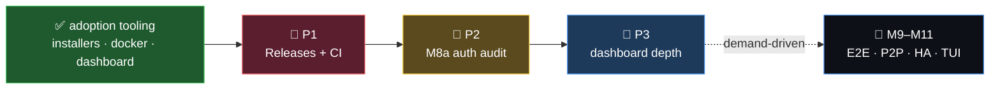

# 🗺️ devbox — What's Next (PRD)

> 📋 A short, honest backlog for what comes **after** the adoption push (installers + Docker + dashboard).
> Ordered by leverage, not by milestone number. Every item lists why it matters, its scope, and how we'll
> know it's done. M9–M11 stay **demand-driven** — captured, not committed.

## 🎯 Where we are
v1 is complete + audited + hardened. **M8 (v2 foundations) shipped & fleet-verified**: schema migration runner,
per-`(share,id)` snapshots, daemon control socket + `pause`/`resume`, **M8a teams** (principals · roles · invites
with attenuation · members), and `restore` byte-safety. Plus an **embedded live dashboard**, **cross-platform
installers** with keep-alive services, a **hub Docker image** for NAS, and **macOS Full Disk Access** detection.

---

## 🥇 P1 — Releases + CI (close the adoption loop)

**Why:** the `curl | sh` installer and the Docker image are built, but the installer's *primary* path —
download a prebuilt binary — **has nothing to download** (no published release), so it silently falls back to
`go build` / local `dist/`. A stranger can't adopt devbox without Go + the repo. This is the one gap between
"we built adoption tooling" and "someone can actually adopt it." CI also gives the whole v2 codebase the
**regression safety it currently lacks**.

**Scope**
- [ ] `scripts/release.sh` — tag → cross-build (reuse `build-release.sh`'s 8 targets + `SHA256SUMS`) → **upload to BOTH Forgejo and GitHub releases** via their APIs (Forgejo token at `~/.config/forgejo/token`; `gh` for GitHub).
- [ ] Asset names the installer already expects: `devbox_<os>_<arch>` / `devbox-hub_<os>_<arch>` (+ `.exe`) under a `latest` (or versioned) tag, so `install.sh` / `install.ps1` download cleanly.
- [ ] CI workflow (Forgejo Actions `.forgejo/workflows/` + mirror to GitHub Actions): `go vet` + `go build ./...` + `go test ./... -race` on push; `build-release` + draft release on tag.
- [ ] Publish the hub Docker image to the Forgejo container registry (`git.shoemoney.ai/shoemoney/devbox-hub:latest`) so compose can `image:` instead of `build:`.

**Acceptance**
- ✅ On a **clean Pi with no Go**, `curl -fsSL …/install.sh | sh` installs a working `devbox` from a real release.
- ✅ `docker compose up -d` on the NAS pulls the published image (no local build).
- ✅ CI is green on `main` and blocks a red PR.

**Gotcha to check first:** Forgejo Actions needs runners enabled. If they're not, ship `release.sh` as a
**local one-shot** (run by hand) and defer the on-tag automation. Don't block the release on CI infra.

**Effort:** M · **Risk:** low (no product code changes).

---

## 🥈 P2 — Adversarial audit of the M8a auth surface

**Why:** M8a added real **privilege** code — invite **attenuation** (`meta.MayGrant`), the push **write-gate**,
principal binding on join, token handling. It has unit + HTTP + fleet tests, but no dedicated *adversarial* pass.
This is the M7.5 treatment for v2's new attack surface, **before** anyone relies on it for multi-owner shares.

**Scope (hunt for, with regression tests for each real finding)**
- [ ] **Invite replay / reuse** — can a redeemed invite token be used twice? (`tokens.used` + the binding.)
- [ ] **Privilege escalation** — any path where `MayGrant` is bypassed; self-invite to a higher role; granting `+s` you don't hold; touching a principal who outranks you.
- [ ] **TOCTOU** on the legacy→explicit flip + self-seed (concurrent first grants; `publishMu` coverage).
- [ ] **Revoked-device bearer reuse** + whether revocation actually closes write access immediately.
- [ ] **Cross-share leakage** — does a member grant on share A ever imply rights on share B?
- [ ] Join PoP edge cases under the new binding path.

**Acceptance**
- ✅ Each confirmed finding has a failing-then-passing regression test; `-race` clean; fleet-verified where it matters.
- ✅ A short `docs/M8a-audit.md` recording findings + the residual single-owner-threat-model deferrals.

**Effort:** M · **Risk:** medium (security-sensitive — do it carefully, don't rush).

---

## 🥉 P3 — Dashboard depth (delight, not load-bearing)

**Why:** the live dashboard wows already, but it only animates `join` + `push`. More flow types + a terminal
view would make it a genuinely complete ops surface.

**Scope**
- [ ] Emit `pull` (head fetch / propagation), `gc` (sweep), and `conflict` flow events from the hub; animate them.
- [ ] A historical sparkline window persisted server-side (currently the frontend computes rates from the live stream only).
- [ ] *(Optional)* an **M11 TUI** over the daemon control socket (`devbox top`?) — re-adds the `/events` SSE stream we trimmed, now with a real consumer (bubbletea).

**Acceptance**
- ✅ A `gc` run and a multi-device `pull` both visibly animate; new event types fleet-verified on the SSE stream.

**Effort:** S–M · **Risk:** low.

---

## 🔮 Deferred — demand-driven (per the v2 spec's own guard)

Do **not** pre-build these — there's no user who needs them yet, and the spec explicitly defers them:

| Milestone | Trigger to build it |
|---|---|
| **M9 — E2E (convergent encryption)** | a real **untrusted-hub** user appears (you self-host on your own NAS → you trust it) |
| **M9 — S3/R2 + Litestream HA** | hub durability/DR becomes a felt need beyond NAS snapshots (slots behind the `blobstore.Store` seam) |
| **M9 — read-side ACL gating** | a genuinely untrusted **multi-owner** share exists |
| **M10 — LAN P2P chunk exchange** | the hub uplink actually hurts (today the hub is *on* the LAN) |
| **M10 — conflict sidecar + diff3 resolver** | conflicts get frequent enough to want interactive 3-way merge |
| **M11 — full TUI + power sanity** | on demand |

---

**Recommendation:** start at **P1**. It finishes the adoption story you just set and hardens the build —
highest leverage, lowest risk. 🚀

