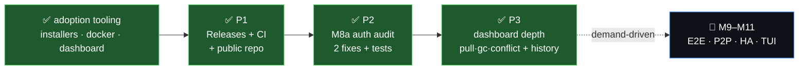

# 🗺️ devbox — What's Next (PRD)

> 📋 A short, honest backlog for what comes **after** the adoption push (installers + Docker + dashboard).
> Ordered by leverage, not by milestone number. Every item lists why it matters, its scope, and how we'll
> know it's done. M9–M11 stay **demand-driven** — captured, not committed.

## 🎯 Where we are
v1 is complete + audited + hardened. **M8 (v2 foundations) shipped & fleet-verified**: schema migration runner,
per-`(share,id)` snapshots, daemon control socket + `pause`/`resume`, **M8a teams** (principals · roles · invites
with attenuation · members), and `restore` byte-safety. Plus an **embedded live dashboard**, **cross-platform
installers** with keep-alive services, a **hub Docker image** for NAS, and **macOS Full Disk Access** detection.

**🚀 P1 shipped (2026-06-23):** real published release (`latest`, 6 OS/arch incl. **linux/arm64** for Pi),
a one-shot `scripts/release.sh`, CI on Forgejo + GitHub Actions (vet · build · `-race`), the hub image in the
Forgejo registry, and a public **`shoemoney/devbox-dist`** repo so `curl|sh` works **with no token**. The
**GitHub repo is now public** (AGPLv3, module path `github.com/shoemoney/devbox` → `go install` works) after a
clean two-scanner git-history secret sweep. Verified end-to-end on clean no-Go amd64 **and arm64** boxes.

---

## ✅ P1 — Releases + CI (close the adoption loop) — **SHIPPED 2026-06-23**

**Why:** the `curl | sh` installer and Docker image were built, but the installer's *primary* path —
download a prebuilt binary — **had nothing to download** (no published release), so it silently fell back to
`go build` / local `dist/`. A stranger couldn't adopt devbox without Go + the repo. P1 closed that gap and gave
the v2 codebase the **regression safety** it lacked.

**Shipped**
- [x] `scripts/release.sh` — one-shot: cross-build (now **6 targets incl. `linux/arm64` + `linux/arm`** for Pi) → create/update the release → upload **de-versioned** assets (`devbox_<os>_<arch>`, `+.exe`) the installer downloads directly, plus a de-versioned `SHA256SUMS` so `shasum -c` matches. Idempotent.
- [x] CI on **Forgejo Actions** (`.forgejo/workflows/`) **+ GitHub Actions** mirror: `go vet` · `go build ./...` · `go test ./... -race` on push/PR; release-on-tag workflow ready. **GitHub CI is green on every push** (Forgejo waits on a self-hosted runner — per the gotcha, the local `release.sh` is the real path).
- [x] Hub image published to the Forgejo registry: `git.shoemoney.ai/shoemoney/devbox-hub:latest`; compose now `image:` by default (`--build` for local source).
- [x] **Deviation (approved):** the source repo stays private, so a public **`shoemoney/devbox-dist`** repo carries the installers + binaries as release assets → `curl|sh` works **with no token**. Separately, the **GitHub mirror was made public** (AGPLv3 — matching the open-core moat, module path `github.com/shoemoney/devbox` so `go install …/cmd/devbox@latest` works) after a clean two-method git-history secret scan.

**Acceptance — all met ✅**
- ✅ Clean **no-Go** box, `curl -fsSL …/install.sh | sh` installs a working `devbox` from the real release — verified end-to-end on **amd64** and **fleet-verified on a real clean no-Go arm64 Raspberry Pi** (`192.168.1.13`): anon `curl|sh` → `devbox 0346995`, `devbox doctor` reports `linux/arm64`.
- ✅ `docker compose up -d` pulls the published image (no local build) — verified on the NAS (throwaway stack, production hub untouched).
- ✅ CI green on `main` (GitHub Actions) and gates PRs.

**Effort:** M · **Risk:** low — landed without product-code changes (module-path rename only).

---

## 🥈 P2 — Adversarial audit of the M8a auth surface

**Why:** M8a added real **privilege** code — invite **attenuation** (`meta.MayGrant`), the push **write-gate**,
principal binding on join, token handling. It has unit + HTTP + fleet tests, but no dedicated *adversarial* pass.
This is the M7.5 treatment for v2's new attack surface, **before** anyone relies on it for multi-owner shares.

> ## ✅ SHIPPED 2026-06-23 — 13-agent adversarial pass (6 finders + skeptic verify), **2 real findings fixed**, rest documented as single-owner residuals. Full report: [`docs/M8a-audit.md`](docs/M8a-audit.md).

**Findings (hunted with regression tests for each real one)**
- [x] **Invite replay / reuse** — ✅ defended: `RedeemToken` is an atomic CAS; sequential + concurrent double-redeem both fail; PoP checked before redeem.
- [x] **Privilege escalation** — 🛠️ **FIXED**: `MayGrant` never attenuated the granted `+s` bit (`req.Reshare` copied verbatim) — now `MayGrant(…, grantReshare)` rejects conferring `+s` you don't hold (owners unconstrained). Role bounding / no-demote-up / server-derived caller role were already solid.
- [x] **TOCTOU** legacy→explicit flip — ✅ defended by `publishMu`; the push-gate micro-race is an accepted low-risk residual.
- [x] **Revoked-device bearer reuse** — ✅ defended: `revoked=0` filtered in both `DeviceByBearer` and `EffectiveMember` (denied on the next request).
- [x] **Cross-share leakage** — ✅ defended: redemption binds share/principal/role from the server-side binding, never the request.
- [x] **Join PoP** — ✅ defended; surfaced that invites were **unrevocable bearer capabilities** → 🛠️ **FIXED**: added `meta.RevokeInvite` + `POST /v1/invite/revoke` + `devbox invite revoke <token>`.

**Acceptance — met ✅**
- ✅ Both fixes have failing-then-passing regression tests (`TestInviteCannotGrantReshareCallerLacks`, `TestInviteRevoke`, +5 `TestMayGrant` cases); `go test ./... -race` clean (18 pkgs). The hub binary carrying these changes ran clean on the real arm64 Pi (via the P3 fleet-verify); the auth logic is platform-independent, so HTTP+race is the load-bearing verification.
- ✅ [`docs/M8a-audit.md`](docs/M8a-audit.md) records findings, confirmed defenses, and the residual single-owner-threat-model deferrals.

**Effort:** M · **Risk:** medium (security-sensitive — done carefully, not rushed).

---

## ✅ P3 — Dashboard depth — **SHIPPED 2026-06-23**

**Why:** the live dashboard wowed already, but it only animated `join` + `push`. P3 made it a genuinely
complete ops surface.

**Shipped**
- [x] Hub emits `pull` (head fetch / propagation, `handleHead`), `conflict` (stale-parent push, `handlePush`), and `gc` (in-process sweep) flow events. GC runs in-process via opt-in `serve --gc-every <dur>` (default off — auto-deleting blobs on a timer is opt-in) so the hub self-maintains *and* each sweep animates.
- [x] **Server-side history window**: per-minute activity buckets (push/pull/conflict/gc + bytes, last 60 min) in `/api/state` → the sparkline now survives a page reload (was live-stream-only). Recorded under the `Emit` lock; race-clean.
- [x] Frontend (`index.html`, one file, no new deps): `pull` = teal inbound pulse, `conflict` = red collision burst, `gc` = amber hub sweep + toast; stacked per-minute history sparkline seeded from `/api/state` and growing live.
- [~] *(Optional M11 TUI)* — skipped, demand-driven (no consumer yet).

**Acceptance — met ✅**
- ✅ `gc`, `pull`, `conflict` (plus `join`/`push`) all visibly animate; **all 5 fleet-verified on the live SSE stream on a real arm64 Pi** (`192.168.1.13`) by `scripts/dashboard-fleet-verify.sh` (also a `LOCAL=1` mode). Frontend rendered headless with **0 console errors**; history sparkline + gc toast + all event feeds present. Tests: `TestHistoryRing`; `go test ./... -race` clean.

**Effort:** S–M · **Risk:** low.

---

## 🔮 Deferred — demand-driven (per the v2 spec's own guard)

Do **not** pre-build these — there's no user who needs them yet, and the spec explicitly defers them:

| Milestone | Trigger to build it |
|---|---|
| **M9 — E2E (convergent encryption)** | a real **untrusted-hub** user appears (you self-host on your own NAS → you trust it) |
| **M9 — S3/R2 + Litestream HA** | hub durability/DR becomes a felt need beyond NAS snapshots (slots behind the `blobstore.Store` seam) |
| **M9 — read-side ACL gating** | a genuinely untrusted **multi-owner** share exists |
| **M10 — LAN P2P chunk exchange** | the hub uplink actually hurts (today the hub is *on* the LAN) |
| **M10 — conflict sidecar + diff3 resolver** | conflicts get frequent enough to want interactive 3-way merge |
| **M11 — full TUI + power sanity** | on demand |

---

**Recommendation:** start at **P1**. It finishes the adoption story you just set and hardens the build —
highest leverage, lowest risk. 🚀

